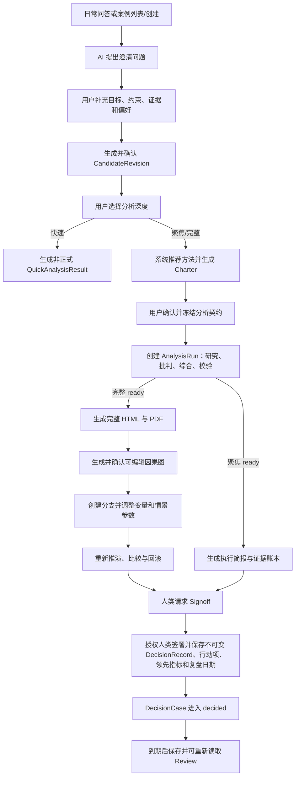

# 02. PRD 与用户流程

## 产品范围

Ludus Alpha 提供一个围绕 `DecisionCase` 的三模式工作台：

1. 决策讨论模式：通过对话和结构化面板收集 5W1H、目标、约束、事实、假设、未知项、选项、分歧和下一步行动。
2. 深度决策报告模式：基于决策档案发起研究和综合，生成一页简报、详细分析、HTML 和 PDF。
3. 决策沙盘模式：从报告和决策档案生成可干预模型，默认引导用户压力测试当前建议、寻找翻转条件和生成验证行动；完整因果图、三情景、分支和敏感性分析渐进展开。

三种模式围绕同一个 `DecisionCase` 协作，但不直接共享可变状态：日常问答把结构化提取写入 `CandidateRevision`；用户确认后才生成 `DossierVersion` 或 `CaseVersion`；正式分析读取 Charter 冻结快照；沙盘读取通过质量门的 Run/Report，并在 `GraphBranch` 工作副本上实验。分析和沙盘只产生候选更新，用户采纳后才生成正式版本和事件。

## P0 功能

| 模块 | P0 功能 |
|---|---|
| 案例列表与创建 | 从自由对话、案例列表或原始问题创建决策项目，不要求先选模板；可进入历史 Case 并查看状态/版本 |
| 澄清对话 | AI 生成澄清问题，用户回答后更新结构化档案 |
| 最小文件入口 | 上传 PDF、TXT 或 Markdown，形成 Workspace-scoped RawArtifact 后进入信息质量流程 |
| 决策档案 | 展示事实、证据、假设、未知项、选项、分歧、行动项，候选可确认/修改/否决 |
| 深度研究 | 创建或取消 AnalysisRun，检索或使用缓存资料，产出结构化研究包；取消保留审计事件且不发布正式产物 |
| 报告生成 | 生成一页简报、详细报告、HTML、PDF，支持预览、下载和 PDF 失败后重试 |
| 论证树 | 展示选项、支持理由、反对理由、关键假设、证据引用 |
| 沙盘生成 | 从报告生成初始因果图，用户可确认/修改/否决自动节点和边，保存为不可变图版本 |
| 推演 | 三情景、关键变量调节、敏感性排序、建议变化提示 |
| 决策签署 | 人类先请求 signoff，再独立签署保存不可变决定、条件、阈值、退出条件、行动项、领先指标、来源版本和复盘日期 |
| 数据源目录 | 内置 Exa、Firecrawl、Tavily 和用户文件，允许 Workspace 添加 BYOK 只读来源并查看状态 |
| 图版本 | 工作副本 undo/redo、保存版本、创建实验分支、比较和非破坏性回滚 |
| 最小复盘 | 保存并读取 `Review`，关联当时决定、报告和图版本；自动到期提醒活动后实现 |
| 外部状态 | 证据、任务、报告持续显示 `live`、`cached` 或 `fixture` |
| 最坏降级 | 真实模型、搜索或抓取经审核 fallback/缓存后仍不能完成金路径时，由用户明确加载 deterministic fixture；其他核心流程仍真实运行 |

## P1 增强项

- 更多正式方法包：定价、渠道选择、招聘关键岗位、融资时机、国际化进入。
- 基于向量检索的历史决策库。
- 多轮报告修订和审批状态。
- 更精细的来源评分、过期检测和冲突聚类。
- 沙盘中的蒙特卡洛近似采样和变量分布编辑。
- 浏览器内 PDF 批注和报告评论。
- 基于评估集的报告质量评分。

## 黑客松后再做

- 企业级 SSO、复杂 RBAC、权限矩阵和审计合规；P0 仍实现简单 Workspace 隔离。
- 计费、套餐、用量控制和企业账单。
- 多人实时协作和冲突合并。
- 精确预测未来或自动交易式决策。
- 全行业通用知识库和长期自动爬取。
- 对公司内部敏感系统的深度连接器。

## 用户故事

| 角色 | 用户故事 | 验收标准 |
|---|---|---|
| 创始人 | 我想把一个模糊机会转成结构化决策档案 | 创建项目后 5 分钟内得到澄清问题和初始 `DecisionCase` |
| 产品负责人 | 我想区分事实、假设和偏好 | 每条条目有类型、来源或理由，用户可手动改类型 |
| 战略负责人 | 我想看到报告中的证据和反方意见 | 报告中主要判断可跳转到证据和反方审查 |
| 决策者 | 我想知道建议在什么条件下成立 | 简报必须包含条件、阈值、退出条件和复盘日期 |
| 演示者 | 我想在网络失败时仍然展示完整链路 | 预置 Case 输入与 `external/` fixture 响应驱动真实 Worker、质量门、报告、PDF 和因果图流程；不得直接加载预置派生产物 |

## 端到端流程

## 决策讨论模式流程

1. 用户从登录后的日常问答开始，或从案例列表点击“新建案例”/进入历史 Case；输入原始问题，例如“资金与研发资源有限时，球形机器人应该优先进入救援市场还是家庭服务市场”。
2. 系统将决策类型作为候选推断，同时识别时间边界、目标、约束和已有材料，不要求用户先选模板。
3. AI 生成 6 到 10 个澄清问题，按优先级排列。
4. 用户回答或跳过问题，系统将回答转成 `CandidateRevision`，不会直接改变正式档案。
5. 用户可上传 PDF、TXT 或 Markdown 作为最小文件输入；文件形成 RawArtifact 并显示处理/拒绝状态，不直接成为正式事实。
6. 系统展示档案面板与 `ArgumentTree`：5W1H、事实、假设、未知项、选项、分歧、支持/反对理由和下一步。
7. 用户可编辑条目类型、支撑质量等级、来源和所属选项；不显示总正确概率。
8. 用户确认、修改或否决候选；只有确认内容才生成 `DossierVersion`/`CaseVersion` 和事件。

验收标准：

- 新项目必须生成可读标题、决策问题、候选决策类型和初始版本号。
- AI 问题必须覆盖目标、期限、不可逾越约束、成功指标、关键证据、不可接受风险。
- 用户修改结构化条目后，论证树和报告输入摘要同步更新。
- 案例列表/创建、PDF/TXT/Markdown 上传和 `ArgumentTree` 均有加载、空态、错误态与跨 Workspace 隔离。

## 深度决策报告模式流程

1. 用户点击“分析这个问题”，选择快速分析、聚焦研究或完整战略分析。
2. 快速分析直接基于已确认档案生成会话内 `QuickAnalysisResult`，不创建 Charter、正式 Run、报告、PDF 或沙盘。
3. 聚焦/完整分析先由 `MethodRouter` 基于已确认档案推荐方法包，返回匹配状态、理由、边界和缺失输入。
4. 系统生成 `AnalysisCharter`；用户补充缺口或确认问题、范围、分析等级、方法版本、材料和预算。
5. 只有确认且 `formalAnalysisAllowed=true` 的 Charter 能创建 `AnalysisRun` 并冻结当前 Case/档案快照。
6. Run 进行中可由用户取消；取消必须进入 canonical 终态、停止后续发布并保留已写入的事件/阶段产物。主链未取消时，研究 Worker 生成检索计划、证据账本和因子结论。
7. 批判 Worker 生成反方审查、盲点和脆弱假设。
8. 综合 Worker 输出结构化建议、残余不确定性和报告草稿。
9. 校验 Worker 检查引用、冲突、过期资料、缺失字段和建议边界。
10. 质量门通过后 Run 进入 `ready`：`focused` 生成 `FocusedResearchResult`（执行简报、结构化建议、证据账本、反方、剩余未知和六维质量画像），不生成 PDF 或正式沙盘；`full` 生成完整 `StructuredReport`、详细 HTML 和 PDF。阻断时只保留明确标识的草稿和修复动作。
11. 只有 `full` 的 ready Run 可以从报告生成正式沙盘；`focused` 可直接保存条件化决定，也可新建 `full` Charter 继续分析。

运行中干预不直接修改 Charter 或 Run 输入。系统先写 `RunInterventionClassification`：冻结范围内的来源冲突裁决、既有硬约束确认、已授权 Provider 恢复属于 resolution，可追加 `RunResolution` 并回到 `lastResumableStage`；改变问题、目标、选项、偏好权重、硬约束定义、材料/连接器范围、预算、方法或分析深度属于 amendment，必须创建 replacement Charter，确认后启动 new Run 并取消关联旧 Run。`blocked` 和 `cancelled` 都是终态。

验收标准：

- AnalysisRun 有可见进度和事件日志。
- 主界面不要求选择方法论名称；Charter 显示推荐方法、版本、理由和适用边界。
- 非匹配问题只能继续问答或运行带“非正式”标识的快速分析，不能生成正式报告。
- 报告必须包含来源列表、六维质量画像、反方意见和条件化建议。
- HTML 与 PDF 来自同一个结构化报告对象，内容不应漂移。
- Run 取消后刷新页面仍显示取消状态，不能继续生成正式报告；HTML/PDF 导出权限和失败重试由服务端合同决定。
- `needs_attention` 页面必须区分 resolution 与 amendment，不能用一个“继续”按钮把预算或新材料写回原 Run。

## 决策沙盘模式流程

1. 用户在报告页点击“生成沙盘”。
2. 系统先显示当前条件化建议、成立条件和最多三个最脆弱条件；每项标明是否可控、证据状态和可能影响，不先要求用户阅读完整因果图。
3. 用户选择一个条件进行压力测试，通过业务单位滑杆调整变量，或选择一个由 Scenario Planning 产出并确认的结构化业务情景。
4. 系统重新计算并显示相对基线变化、建议是否保持、翻转阈值、硬约束和一至三阶关键影响路径。
5. 用户可把结果转为验证行动或保存为命名实验分支；需要检查模型依据时再展开完整因果图。
6. 完整模型中，系统从报告提取节点并生成带方向、强度、延迟、关系质量和依据的草稿边；高影响低质量项优先展示，用户可逐条或批量确认、修改、否决。
7. 完成正式图确认后，用户可运行正式 SimulationRun、继续编辑工作副本、比较两个版本，或通过从历史快照创建新当前版本完成非破坏性回滚。
8. 用户将采纳的沙盘结论提交为候选档案更新，确认后才写回 `DecisionCase` 或主体长期档案。
9. 保存决定后，用户可创建并重新打开最小 `Review`；Review 只记录现实复盘，不把沙盘结果冒充实际结果。

验收标准：

- 用户无需先编辑因果图，即可从当前建议完成一次变量或情景压力测试，并看懂建议保持或翻转的原因。
- 因果图展开后支持节点编辑、边编辑、情景切换、变量滑杆、敏感性排序。
- 每个自动节点和每条自动边必须保留来源理由，用户可确认、修改或否决；未完成图确认不得保存正式图或运行正式 SimulationRun。
- 每次推演必须绑定 graph、strategy、scenario 和 engine 版本；相同输入必须可复现。
- 推演结果必须明确标注“用于因果推演和敏感性分析，不是精确预测”。
- 压力测试结果必须显示业务单位、相对基线变化、关键影响路径、翻转阈值或“当前范围内未翻转”，不得只显示抽象分数。
- Review 保存后可读取其来源决定、报告和图版本；复盘提醒不作为 72 小时阻断项。

## 安全与合同失败流程

- mutation 缺失或错误 CSRF 证明时拒绝请求并返回 `CSRF_VALIDATION_FAILED`，UI 重新获取 token，不静默重试跨 Origin 请求。
- 远程 URL 未通过协议、DNS/IP、重定向或响应大小校验时返回 `UNSAFE_REMOTE_URL`，不能改用无校验抓取。
- generated client 与 OpenAPI 漂移时构建失败，不允许前端临时手写兼容 DTO。
- QA 发现产品源码缺陷时创建 handoff，由原 owner 修复；QA 不跨 ownership 直接改组件。

## 实时与最坏降级流程

1. 正常金路径优先调用真实模型、Exa、Firecrawl，并在必要时切换 Tavily。
2. 已抓取且保留哈希的材料标记为 `cached`，不得显示为本轮实时获取。
3. 模型、搜索、抓取或网络均不可用时，系统说明故障和影响，用户明确选择后加载 deterministic fixture。
4. fixture 只替代外部输入；Workspace、Case、Charter、Run、事件、质量门、报告渲染、沙盘算法、图版本和决定保存仍走真实实现。
5. `live/cached/fixture` 状态进入 UI、事件、证据、报告页和导出物。

## 验收场景

P0 预置案例：`资金与研发资源有限的球形机器人项目，应该优先进入救援市场，还是家庭服务市场？`。

验收输入：

- 项目已有球形机器人原型，但续航、载荷和复杂地形能力仍需验证。
- 团队资金与研发资源有限，只能优先验证一个市场方向。
- 目标是在现金窗口内验证真实需求、交付可行性和可持续商业路径。
- 关键担忧是救援采购周期、家庭场景安全责任、产品改造成本和路线切换成本。

验收输出：

- 决策档案含 5W1H、至少 8 条事实/证据、6 条假设、3 个选项。
- 报告含一页简报、详细 HTML、PDF、来源列表和反方审查。
- 沙盘含不少于 8 个节点和 10 条边，可显示三情景下推荐变化。
- 最终决定包含行动项、负责人、领先指标、退出条件和复盘日期。
- 一条 Review 可保存并重新读取，且不覆盖原决定或来源版本。
