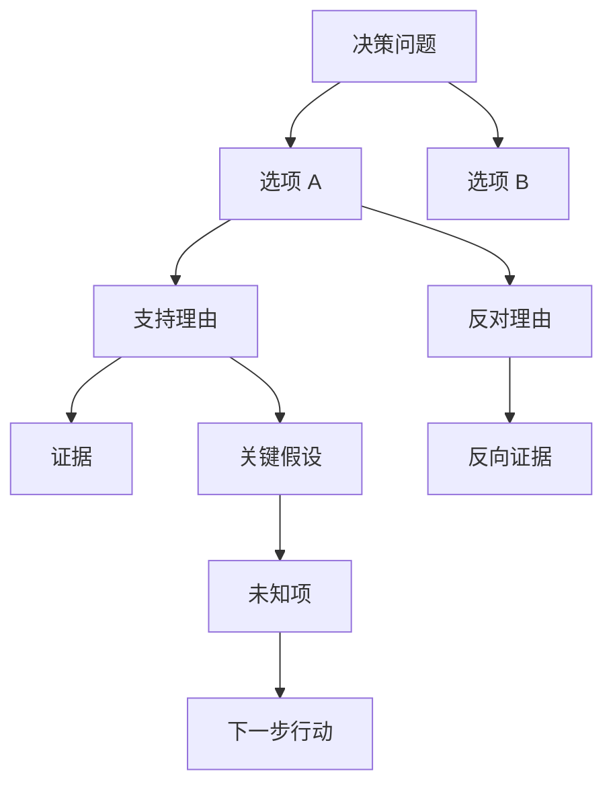

# 04. 决策方法论

## 方法论目标

Ludus 的方法论服务一个目标：让决策人能解释为什么做出某个决定，以及在什么条件下应该改变这个决定。系统需要把讨论、研究、报告和沙盘都约束到同一套决策语义中。

## 方法选择原则

用户不先选择方法模板。系统从已确认档案和当前问题中归纳决策类型、目标、约束、选项和未知项，再根据已发布方法包的适用/排除规则推荐方法。用户只选择快速分析、聚焦研究或完整战略分析；快速分析留在对话中，聚焦/完整分析才在 `AnalysisCharter` 中确认方法版本、理由、适用边界、材料和预算。

通用决策内核始终启用。P0 只有 `hardtech-market-direction@1.1.0` 能生成正式聚焦研究或完整战略分析；不匹配问题只能继续讨论或运行明确标记为非正式的快速分析。

## 方法包发布与模型边界

第一版方法源已位于 `decision-lab/ways/hardtech-market-direction/1.1.0`。它是从 `探讨` 的 framework selector、RAG pool、分析 Agent、安全锚点、战略综合、参谋长、魔鬼审查、质量门、交付标准及下述五个战略透镜沉淀出的可审阅合同。开发阶段只能修改 `ways`；安装器必须校验 manifest、诊断问题、Prompt、schema、质量门、工具权限、预算、eval、来源版本和路径边界，再生成带内容哈希、状态为 `published` 的不可变 `method-packs/hardtech-market-direction/1.1.0`。Router 和 Worker 运行时只读取后者。

第一版方法包的所有 Worker、战略透镜、质量门、eval 和报告渲染必须服从六项不变量：

1. **决策视角先于框架**：Charter 先冻结最终决策人、目标、成功标准、责任边界和硬约束，再选择或执行框架；事实不随视角改变，但风险承担和策略判断会改变。
2. **致命短板不可补偿**：需求、采购、交付、安全、现金或供应链的 `fatal_fail` 不能被 TAM、增长率、品牌价值或平均分抵消；所有选项均失败时允许不给出市场赢家。
3. **资源尺度会改变策略性质**：团队人数、现金窗口、融资阶段、采购周期和交付能力变化时必须重算路径，不能把种子期结论线性外推到天使期，也不能把更多资金自动解释为同时扩张。
4. **证据裁决必须约束使用方式**：`conditional` 只能支撑带条件判断，`lead_only/rejected` 不能支撑核心结论；时间、样本、地域、币种、口径或分母错配必须降级或阻断。
5. **反方发现必须改变正式产物**：Safety Anchor、Counterparty、Pre-Mortem 和魔鬼审查的重要发现必须改变建议、条件、阈值、退出标准、质量画像或沙盘，只写入风险附录不算完成消费。
6. **决策质量与结果质量分离**：报告必须保存当时证据、脆弱假设、领先指标、复盘日期和翻转条件，使 Review 能区分坏结果、坏执行、外部冲击和坏决策过程。

P0 默认通过 DeepSeek 官方 API 使用 `deepseek-v4-pro`。Research、Critic、Synthesis、Validation 是四个隔离的编排角色，可以共享同一基座模型，但必须各自拥有独立 Prompt、上下文、阶段产物、预算、事件和 tool trace，不能把四个角色描述为四个独立基础模型。方法包保持 OpenAI-compatible、厂商无关，所有结构化输出都由服务端 schema 校验。

DeepSeek thinking mode 返回的 `reasoning_content` 只允许存在于同一轮工具调用链的内存态协议信封中；为完成官方工具回传协议可以在该调用链内原样带回，但不得写入数据库、日志、事件、trace、报告、上下文压缩或 UI。Ludus 的可追溯性来自命题、证据、假设、判断、方法版本、工具摘要、质量门、图和模拟输入输出，而不是保存隐藏思维链。

## 5W1H 框架

每个 `DecisionCase` 必须先形成基础 5W1H：

| 字段 | 说明 | 示例 |
|---|---|---|
| Why | 为什么现在要做这个决定 | 资金和研发资源有限，无法同时验证两个市场方向 |
| What | 要决定的具体事项 | 球形机器人优先进入救援市场还是家庭服务市场 |
| Who | 受影响和参与的人 | 创始人、工程团队、救援机构采购方、家庭用户和安全责任方 |
| When | 决策期限和观察周期 | 两周内决定，三个月验证，六个月复盘 |
| Where | 市场、渠道、产品位置 | 专业救援机构场景与家庭服务场景 |
| How | 可选路径和执行方式 | 救援试点、家庭服务试点、继续研究后再决定 |

AI 的第一轮澄清问题必须围绕 5W1H 补齐缺口，而不是直接给建议。

## 信息类型分离

Ludus 中的每条关键内容都必须有 `statementType`：

| 类型 | 定义 | 必填字段 |
|---|---|---|
| `fact` | 可被来源或用户记录支持的事实 | 来源、时间、适用范围 |
| `evidence` | 支持或反驳某命题的资料 | URL/文件、来源等级、检索时间 |
| `assumption` | 当前无法直接验证但决策依赖的前提 | 稳定性、验证方式、失效影响 |
| `judgment` | 基于事实和假设形成的分析判断 | 依据、反方、命题支撑质量 |
| `preference` | 用户或组织的价值偏好和约束权重 | 所属决策者、权重、不可接受项 |
| `unknown` | 对决策有影响但当前缺失的信息 | 优先级、获取方式、截止时间 |

规则：

- 没有来源的市场规模不能写成事实，只能写成假设或判断。
- 用户明确表达的风险偏好不是事实，而是偏好。
- 模型综合出的建议是判断，必须链接到事实、证据、假设和偏好。
- 未知项不是失败，它是需要被管理的决策变量。

## 论证树

论证树连接决策问题、选项、支持理由、反对理由、假设和证据。



每个 `ArgumentNode` 至少包含：

```json
{
  "id": "arg_001",
  "type": "support",
  "claim": "救援机构存在进入危险区域前的远程侦察需求",
  "optionId": "opt_rescue_pilot",
  "evidenceIds": ["ev_rescue_interview_03"],
  "assumptionIds": ["asm_procurement_window_is_acceptable"],
  "supportScore": 0.68,
  "status": "open"
}
```

`supportScore` 是命题支撑这一单独维度的归一化质量分数，运行时限制为 `[0, 1]`；它不代表命题为真的概率，也不能替代下文的六维质量状态。

## 五个战略透镜协议

首版方法包必须把以下五项能力作为可执行协议，而不是在通用 Prompt 中提到框架名称。模型先生成不含身份字段、通过判别式 JSON Schema 校验的 `StrategicLensOutput`；服务端再对冻结 Run 解析引用、注入 Workspace/Case/Run/Charter/方法版本/角色/哈希并独立持久化为 `StrategicLensArtifact(status=ready)`。`StructuredReport` 只通过 `lensArtifactIds` 引用它们，不把五份结果压扁为一段无法审计的总结，也不信任模型自报 canonical 身份。

| 透镜 | 执行职责 | 必须回答的问题 | 对后续产物的约束 |
|---|---|---|---|
| `porter_five_forces` | Research | 明确行业边界；逐项评估现有竞争、供应方、购买方、替代品和新进入者，并记录证据、变化趋势和监管影响 | 形成竞争结构和议价约束；五力分数不得直接充当选项决策公式 |
| `pre_mortem` | Critic | 假定建议已经失败；从内部、外部和系统层列出至少五个原因，选出前三风险，并给出预防、应急、检测指标及继续/修改/放弃判断 | 致命风险必须改变建议条件、退出条件或阻断状态，不能只留在附录 |
| `counterparty_response_matrix` | Critic | 选择 1-2 个关键对手方，为每方列出 2-3 个可观察行动及不行动基线，推演最优、最差和最可能响应、响应窗口及我方再响应 | 必须检查公开承诺测试、下行不对称和反身性；关键响应进入沙盘外部节点或条件 |
| `scenario_planning` | Synthesis | 区分既定因素与高影响/高不确定变量；生成至少三个结构不同的情景、时间线、利益相关方状态和预警信号 | 至少一个情景必须使当前策略失效；跨情景稳健性和翻转条件进入报告及情景种子 |
| `meadows_leverage_points` | Synthesis | 明确系统边界、存量/流量、反馈环、延迟、规则和激励；在至少三个杠杆层级提出干预 | 必须指出被忽略的高杠杆选项、失控增强回路和高杠杆干预副作用；映射为沙盘可控杠杆和反馈边 |

执行顺序锁定为：Research 完成 Porter 透镜；Critic 先执行 Safety Anchor，再完成 Counterparty Matrix，以其结果驱动 Pre-Mortem，最后执行 adversarial review；Synthesis 消费前述结果并完成 Scenario Planning 与 Meadows；Validation 逐份检查 schema、证据引用、必填行为和下游消费。五项不是五个新的基础模型或 Worker，仍由四类正式 Worker 在隔离上下文中执行。

`full` 分析必须产生并通过校验的五份透镜产物，缺失任一项时不得进入 `ready`、生成 PDF 或创建正式沙盘。`focused` 不创建 `StrategicLensArtifact`，其普通研究或反方内容不得贴上五透镜正式验收标签；需要完整五透镜审查时必须创建 replacement Charter 并启动 full new Run。Scenario Planning 的方法产物描述战略世界，`ScenarioVersion` 则是用户确认后用于确定性传播的沙盘输入，两者通过来源 ID 连接但不能合并为同一对象。

没有把 `探讨/skills/research` 的 31 个 Skill 全部同时注入一次 Run，不等于丢弃资产。产品级全量处置账本位于 `21-existing-asset-reuse-and-conversion.md`，方法包内的可随版本评审副本位于 `ways/hardtech-market-direction/1.1.0/CAPABILITY-MAP.md`：P0 直接编译、被其他合同吸收、延后到独立方法包、仅作参考或明确禁用必须逐项登记。这样保留已验证知识，同时避免无关框架争夺上下文、互相覆盖术语和耗尽模型/检索预算。

## 反方审查

反方审查不是礼貌性附录，而是报告和建议的必要输入。参考 `探讨/skills/research/v6-devils-advocate/SKILL.md`，P0 至少包含六类检查：

| 检查 | 目的 |
|---|---|
| 核心假设压力测试 | 找到一旦错误就会推翻建议的假设 |
| 最强反对理由 | 站在反方立场提出最有力质疑 |
| 历史失败类比 | 寻找相似策略失败的模式 |
| 利益相关方阻力 | 判断客户、销售、合规、工程的抵触点 |
| 认知偏差检查 | 识别确认偏误、幸存者偏差和近期效应 |
| 致命缺陷检查 | 判断是否存在不值得继续投入的硬伤 |

输出先写入当前 `AnalysisRun` 的 `Challenge` 集合，并在报告和沙盘中可见。需要沉淀为长期知识的挑战只生成候选档案更新，用户确认后才写回。

## 来源冲突处理

当两个来源对同一命题给出相反信息时，系统不应强行平均。处理流程：

1. 将相关证据的 `conflictGroupId` 设为同一组。
2. 标记冲突类型：口径不同、时间不同、样本不同、利益相关方不同、事实相反。
3. 记录每条来源的等级、时间和适用范围。
4. 对时间窗口、样本定义、地域、币种、统计口径和分母做显式对齐；无法对齐时不得把冲突解释为已解决。
5. 综合阶段生成 `conflictResolution`：采纳、并列展示、降权、要求进一步验证。
6. 若冲突影响推荐，简报必须明确说明。

示例：

```json
{
  "claim": "救援机构愿意采购球形机器人用于远程侦察",
  "conflictType": "sample_mismatch",
  "evidenceIds": ["ev_vendor_report", "ev_customer_interview"],
  "resolution": "并列展示，区分一线使用需求与采购预算承诺",
  "impact": "若采购周期超过 12 个月，将推荐从救援试点调整为继续研究"
}
```

## 资料过期处理

每条证据需要 `publishedAt`、`retrievedAt` 和 `freshnessStatus`：

- `fresh`：仍在合理有效期内。
- `aging`：可能受市场变化影响，需要谨慎使用。
- `stale`：不应支撑关键判断，只能作为历史背景。
- `unknown`：无法确认时间，来源降权。

过期阈值由领域决定。P0 可以使用简单规则：市场/竞品资料 12 个月后降为 `aging`，24 个月后降为 `stale`；法规和财务数据按发布日期显示，不自动删除。

## 模型不确定性处理

系统不展示模型内部思维过程，只展示可审计产物：

- 证据列表。
- 判断摘要。
- 支持和反对理由。
- 各维度质量等级、原因和影响范围。
- 未知项和下一步验证。

P0 不计算一个伪精确总置信概率。系统分别表达：

| 维度 | 用户可见状态 | 计算边界 |
|---|---|---|
| 证据可用性 | 充足/有条件/不足/阻断 | 来自来源等级、独立性、时效、相关性和提取可靠性 |
| 命题支撑 | 支持/冲突/仅假设/不支持 | 支持证据与反对证据分开记录，不按来源条数多数投票 |
| 假设稳定性 | 稳定/脆弱/致命未知 | 结合验证状态与错误影响，不由模型自评分单独决定 |
| 因果关系可信度 | 已确认/有条件/草稿/否决 | 与影响强度分开表达 |
| 战略稳健性 | 稳健/情景敏感/存在翻转 | 来自跨情景排名和敏感性分析 |
| 流程质量 | 通过/警告/阻断 | 检查证据、反方、逻辑自洽和综合偏离风险 |

正式质量门可以对若干归一化维度使用乘法门控，但该值只判断是否允许交付：任一关键维度低于阻断阈值即不生成正式 PDF 或正式沙盘。乘法值不表示结论正确概率，也不用于营销中的“成功率”。主界面默认显示“等级 + 原因 + 最脆弱环节”，详细数值只在展开区显示。

模型可以提出维度初评，Validation Worker 必须使用来源、冲突、缺失项和确定性规则复核；未校准的模型自评分不能提升正式状态。

Validation 还必须执行四个不可被平均分绕过的阻断检查：时间/样本/地域/币种/口径/分母是否对齐；Evidence verdict 是否与正文使用方式一致；是否至少比较一个资源尺度反事实并说明策略是否翻转；是否存在可用于 Review 的假设、执行指标、外部冲击和结果记录边界。

## 条件化建议

推荐必须避免单句“建议做 A”。合格建议格式：

```text
建议：优先推进救援市场试点，但只在以下条件满足时执行。
条件：未来 4 周内完成至少 6 个救援机构访谈，其中至少 2 个愿意提供试点意向或测试场地。
阈值：预计采购周期不超过 12 个月，原型续航、通信和复杂地形通过最低试点门槛，投入不突破既定现金窗口。
退出条件：若关键地形能力无法达标、责任边界不可接受，或采购周期超过现金窗口，则停止救援试点并回到继续研究。
领先指标：有效试点意向、采购流程阶段、复杂地形通过率、任务续航、单位改造成本。
复盘日期：2026-10-15。
```

`Recommendation` 对象必须包含：

- 主要选项。
- 替代选项。
- 成立条件。
- 阈值。
- 退出条件。
- 风险和脆弱假设。
- 领先指标。
- 行动项。
- 复盘日期。

## 方法合同与多智能体边界

方法 Prompt、quality gate、StrategicLensArtifact schema 或方法输出字段变化必须先修订本文件、`06-data-model.md` 和 ways 源资产，并提交 CCR；安装器、Worker、前端或 fixture 不得临时增加别名或补写字段。Ways/Agent Pipeline 是唯一方法实现 owner，QA 只以行为测试和 handoff 报告缺陷。

## 复盘协议

最终决定保存后，系统创建复盘计划：

1. 固化当时 `DecisionCase` 版本。
2. 保存决策人的选择、反对意见和未解决未知项。
3. 记录行动项、负责人、截止时间和领先指标。
4. 把复盘日期设置在低成本退出窗口结束之前；若无法做到，必须解释原因并提高升级级别。
5. 到复盘日期前提醒用户补充实际结果。
6. 复盘时分别比较：当时决策过程、执行质量、外部冲击、实际结果和偏差原因，不得仅以结果倒推当时决定好坏。
7. 形成下一次决策可复用的改进项，并保留会触发转向、退出或追加投入的翻转条件。

复盘输出不是追责文档，而是提升团队决策质量的学习资产。
