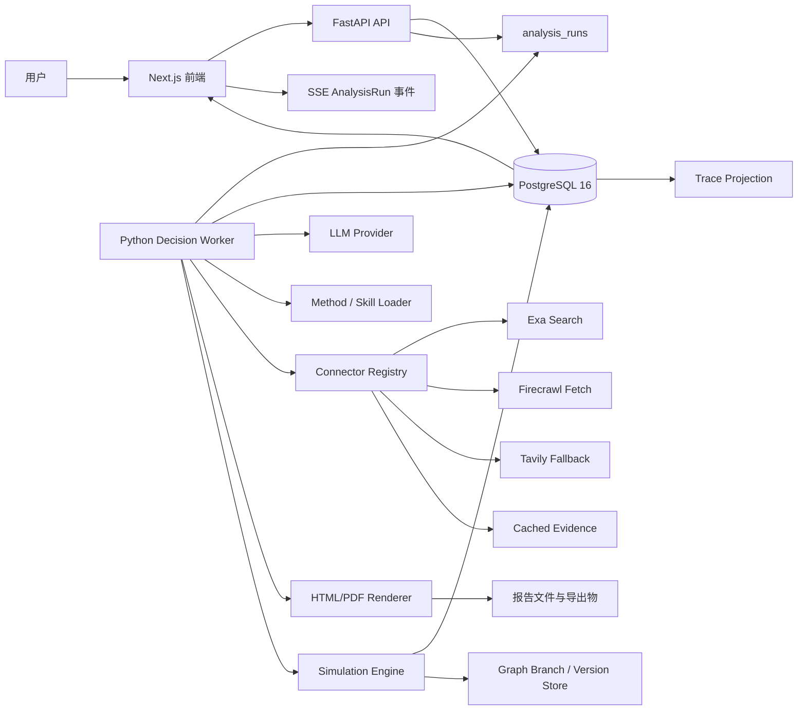
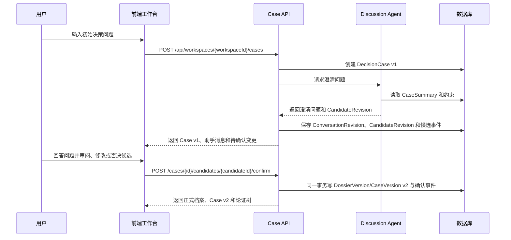
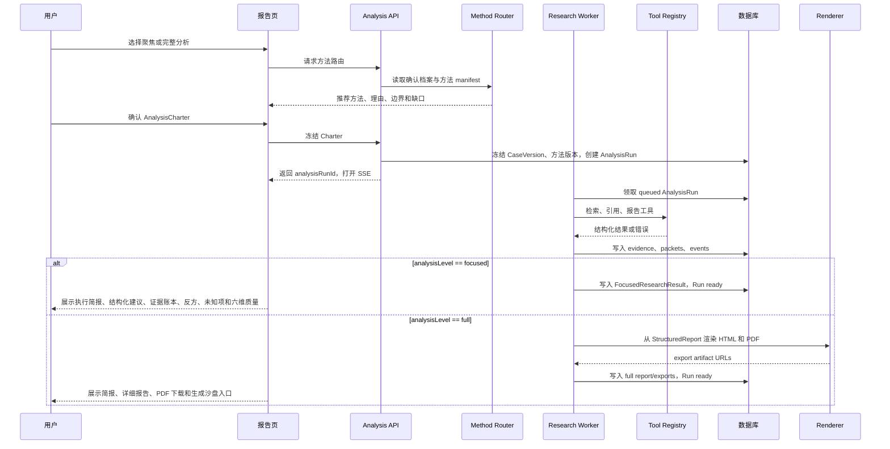
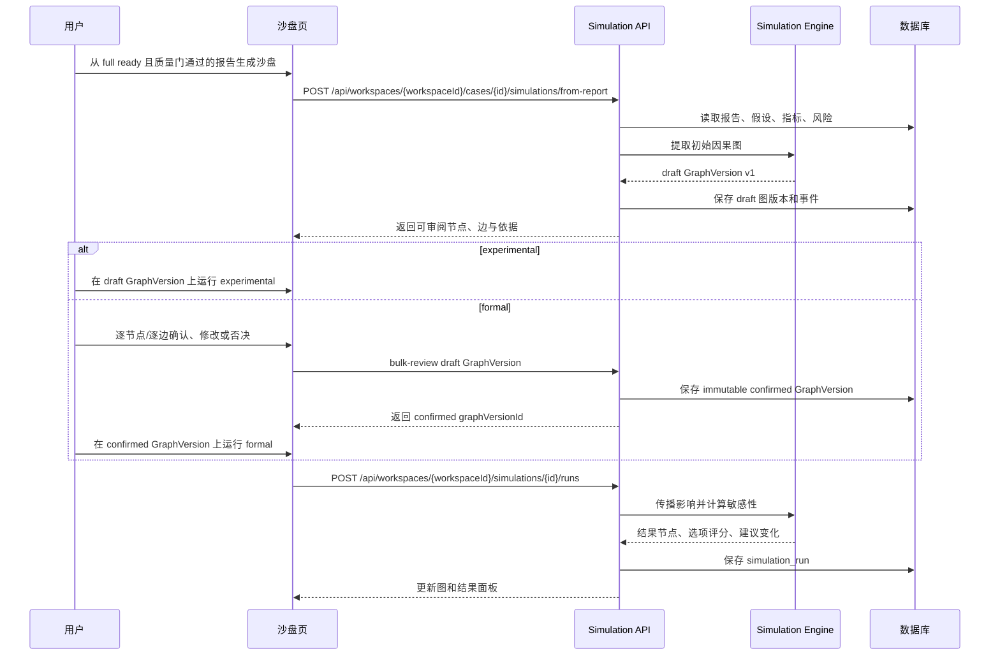

# 05. 系统架构

## 架构目标

Ludus Alpha 的架构目标是用最少组件支撑完整链路：`DecisionSubjectDossier` 提供长期记忆，`DecisionCase` 作为一次正式决策的聚合根，Charter 冻结输入，Run 执行分析，报告与沙盘引用同一快照。分析产物不直接改写正式档案。系统必须可恢复、可观察、可降级，并能在 72 小时范围内完成 P0 金路径。

## 技术选择

| 层 | P0 选择 | 理由 |
|---|---|---|
| 前端 | Next.js + React + TypeScript | 同时覆盖页面、API Route 和 SSR 报告页，学习成本低 |
| UI | Tailwind CSS + 少量自定义组件 | 快速实现密集工作台，不依赖重型设计系统 |
| 图编辑 | React Flow | 成熟的节点/边编辑能力，适合因果沙盘 |
| API 与数据访问 | FastAPI + Pydantic 2 + SQLAlchemy 2 + Alembic | 与 Python Agent/报告链路共享类型和运行时，提供明确迁移边界 |
| 合同生成 | FastAPI OpenAPI + `openapi-typescript` + `openapi-fetch` | Pydantic 是唯一运行时 wire schema，生成 TypeScript types/client，阻止多 Agent 手写平行 DTO |
| Web 安全网关 | CSRF dependency + SSRF-safe HTTP client + rate limit | Cookie mutation、远程抓取和高成本任务在进入领域服务前统一拒绝危险请求 |
| 数据库 | PostgreSQL 16 | 正式支持 Workspace 隔离、并发 Worker、JSONB 和事件持久化 |
| 分析执行 | Postgres `analysis_runs` + Python Worker | 使用 `FOR UPDATE SKIP LOCKED`，避免 P0 引入 Redis/Celery |
| 事件流 | Server-Sent Events | 单向 Run 进度足够，复杂度低于 WebSocket |
| 报告 | 结构化 JSON -> HTML -> Playwright PDF | 比 LaTeX 更适合 Web 演示，仍可吸收 `探讨` 模板思路 |
| Artifact 存储 | Workspace-scoped filesystem + Docker shared volume | P0 不引入对象存储；数据库只保存 path/hash/metadata，接口保持可替换 |
| 模型调用 | LLM Provider 抽象层 | 现场可切换模型、缓存或预置案例 |

`探讨/skills/research/full-mode-composer/SKILL.md` 显示现有模式二有 LaTeX 报告生成能力，但 P0 不把 LaTeX 编译作为现场硬依赖。Hermes 的 `hermes-agent-hermes-hermes-a8a19433/model_tools.py` 和 `hermes-agent-hermes-hermes-a8a19433/tools/registry.py` 支持工具发现、可用性检查和统一分发，Ludus 采用同类模式注册搜索、报告渲染、PDF 导出和沙盘生成工具。

P0 采用“提炼和适配”而非从零搭建：

- `探讨` 的 v6.12.x 技能体系编译为版本化 Method/Skill Pack，生产状态进入数据库。
- Hermes `tools/registry.py`、`mcp_tool.py`、`skill_utils.py` 中边界清楚的注册、frontmatter/schema 解析和错误清洗纯函数按 MIT 带署名抽取适配；`model_tools.py`、`delegate_tool.py`、MCP runtime 和其他状态胶水只提供行为依据，重写为 async、Workspace-scoped 服务。
- Open WebUI `Chat.svelte`、`ToolCallDisplay.svelte`、`Citations.svelte`、`TaskList.svelte` 和 `events.py` 提供 Web 长任务、工具、引用和确认的交互模式；Ludus 使用 React/Next.js 重新实现。

逐文件转换合同见 `21-existing-asset-reuse-and-conversion.md`。架构上必须保持两条独立管线：

| 管线 | 来源 | 编译/适配时机 | 运行时落点 | 禁止 |
|---|---|---|---|---|
| 方法论资产 | `探讨/SOUL.md` 的可泛化原则、`skills/research` 中被批准的 Skill | 发布前编译、评审、提升 SemVer | `ways` -> installer -> immutable `method-packs` | Run 直接读取 `探讨`、动态拼接全部 Skill、让方法包控制密钥/队列 |
| 运行框架机制 | `探讨/config.yaml` 非秘密结构、Hermes、Open WebUI 已验证行为 | Hermes MIT 纯函数 typed/adapted；状态机制和 Open WebUI 行为 reimplemented | `core/config.py`、`methods/*`、`agents/*`、`connectors/*`、React 组件 | 整体复制配置、同步单体循环、Svelte/MCP client、参考项目成为生产依赖 |

`探讨/.env` 与 `探讨/auth.json` 是 **Do not use/Do not inspect**。系统只接受环境注入或服务端加密 secret；预置 fixture、日志和镜像不得包含源凭证。

full Run 只加载已发布 manifest 指定的四类 Worker Prompt、schema、质量门和工具白名单。其他 Skill 已被 canonical 合同吸收、属于后续方法包、仅供参考或禁用；这保证上下文、预算、内容哈希和历史重放稳定。

### DeepSeek V4 Pro Provider 协议边界

官方 DeepSeek V4 Pro 的 thinking mode 默认启用并返回 `reasoning_content`。若同一个 assistant turn 发起 tool call，后续工具结果回传必须把该 turn 的 `reasoning_content` 原样带回官方 API。Ludus 只在单次 Provider 调用链的内存态 transient envelope 中保留它以满足协议；它不得写入数据库、日志、`AnalysisEvent`、tool trace、报告或 UI，也不得成为 canonical 可审计数据。没有 tool call 时立即丢弃；调用链或 Run 中断后也不恢复，而是从最后一个已持久化的结构化阶段重新发起模型调用。

官方 strict tool calls 同时支持 thinking/non-thinking。JSON Output 若偶发返回空 `content`，Provider 必须按结构输出失败处理，并遵循既有的一次 schema 修复/重试规则，不能把空内容当作成功。

## 总体架构图

## 模块边界

| 模块 | 职责 | 不负责 |
|---|---|---|
| Case Service | 创建、读取、更新、版本化 `DecisionCase` | 模型推理 |
| Discussion Agent | 澄清问题、结构化归档、论证树更新 | 深度研究和 PDF |
| Method Router | 根据确认档案和方法 manifest 返回匹配、理由、边界和缺口 | 判断问题是否值得分析、临场发明方法 |
| Research Pipeline | 研究、批判、综合、校验、报告结构化 | 前端渲染细节 |
| Report Renderer | HTML 和 PDF 生成，导出物管理 | 决策推理 |
| Artifact Store | Workspace 路径校验、共享 volume 读写、哈希和流式下载 | 鉴权决策、把正文存进数据库 |
| Simulation Engine | 因果图、情景、敏感性分析 | 精确未来预测 |
| Analysis Orchestrator | `AnalysisRun` 状态、数据库领取、重试、事件和恢复 | Charter 确认与业务判断 |
| Tool Registry | 工具 schema、可用性、统一错误 | 任意隐式副作用 |
| Method/Skill Loader | 编译和加载已发布方法包、frontmatter、版本与内容哈希 | 运行时自动发明方法 |
| Connector Registry | Exa/Firecrawl/Tavily、BYOK、只读范围、额度状态和降级路由 | 任意 MCP、写操作和可信度判断 |
| Contract Generator | 导出 OpenAPI、生成 TypeScript、执行 drift check 和 CCR 影响验证 | 定义领域语义、允许手工修改生成物 |
| Security Gateway | CSRF、SSRF、请求限流、上传嗅探和安全响应头 | 业务授权、证据可信度或方法判断 |
| Trace Projection | 将命题、证据、Agent 产物、报告段落和因果边投影为可跳转关系 | 保存隐藏思维链 |
| Graph Version Service | 工作副本、分支、比较和非破坏性回滚 | 覆盖或删除历史版本 |
| Frontend Workbench | 信息架构、编辑、状态展示 | 服务端任务执行 |

## 数据存储建议

P0 正式数据统一使用 Postgres。复杂结构优先使用 JSONB，租户、状态、版本、索引和高频过滤字段使用明确列与约束：

| 表 | 说明 |
|---|---|
| `workspaces` / `decision_maker_profiles` | 租户边界与独立版本化的个人偏好；不与主体事实混存 |
| `decision_subjects` / `dossier_entries` / `dossier_versions` | 主体长期记忆、条目作用域和不可变档案版本 |
| `initiatives` | 主体下可选的长期计划分组，不替代 DecisionCase |
| `decision_cases` | 一次正式决策的聚合根，保存标题、问题、生命周期和当前版本 |
| `case_versions` | 每次结构化变更后的快照和摘要 |
| `domain_events` | append-only 领域事件，用于审计和投影；分析 SSE 使用关联 Run 的事件子集 |
| `conversations` / `messages` | 用户与 AI 的讨论消息，不作为正式事实来源 |
| `quick_analysis_results` | 会话内非正式快速分析，不产生正式交付物 |
| `raw_artifacts` / `retrieval_tasks` / `quality_assessments` | 上传/检索原件、检索任务与信息质量门结果 |
| `evidence_items` | 证据账本和来源信息 |
| `connectors` | Workspace 级审核目录连接器、启用状态、权限和密钥引用 |
| `connector_calls` | 工具、预算、耗用额度、结果哈希、错误和降级事件 |
| `research_packets` | 因子研究、反方审查、安全锚点、综合结果 |
| `report_artifacts` | focused 简报或 full 详细语义报告 |
| `export_artifacts` | full 报告派生的 HTML/PDF、渲染版本和独立失败状态 |
| `causal_graphs` | 稳定图聚合、当前 head 与来源报告引用 |
| `graph_versions` / `scenario_versions` / `simulation_runs` | 不可变图/情景版本和精确输入链的推演结果 |
| `analysis_charters` | focused/full 的不可变分析契约 |
| `analysis_runs` / `analysis_events` | 正式分析执行、数据库队列、心跳、阶段结果和 SSE 回放 |
| `run_intervention_classifications` / `run_resolutions` | 中断输入分类与 append-only resolution；amendment 不写回旧 Run |
| `decision_records` / `reviews` | 最终决定、行动项、指标、复盘日期和复盘结果 |

原则：聊天记录不能替代结构化档案；聊天结构化提取先写 `CandidateRevision`，不提升 `CaseVersion`。系统生成内容先保存为候选、Run 产物或实验分支，只有用户采纳后才投影为 Case 或主体长期档案新版本。

P0 `ArtifactStore` 实现锁定 filesystem。API、Worker 与 Renderer 必须挂载同一 Docker shared volume，并以 `workspaces/{workspaceId}/uploads/...`、`workspaces/{workspaceId}/reports/{reportArtifactId}/exports/...` 保存文件；数据库只保存相对路径、媒体类型、大小和 SHA-256。所有读取经 FastAPI 重新校验 Workspace 所有权后流式返回，不暴露宿主机路径、不提供 volume 静态直链。稳定接口只暴露 `put(workspaceId, relativePath, stream)`、`open(workspaceId, relativePath)` 和 `stat(workspaceId, relativePath)`，每个方法都重新验证规范化路径仍在对应 Workspace 根目录内。活动后可替换对象存储实现，但 P0 不维护第二套 provider。

所有外部输入与派生产物携带 `originMode = live | cached | fixture`。fixture 只替代外部输入，不替代 Postgres、状态机、质量门、报告渲染、沙盘引擎或图版本服务。

## Web 与 API 所有权

- Next.js 负责页面路由、React 交互、服务端渲染报告阅读页和打印样式，不实现领域写入规则。
- FastAPI 是 Case、Charter、Run、Evidence、Report、Simulation、GraphVersion 和 Decision 的唯一业务 API。
- Python Worker 使用与 FastAPI 相同的 repository/schema，不通过 Next.js API Route 执行分析。
- AnalysisRun 使用持久化事件加 SSE/`Last-Event-ID`；日常聊天可使用短流式响应，但正式任务状态始终以数据库事件为准。

连接器调用先生成不可变 `RawArtifact`，再进入证据规范化和信息质量门。Agent 只调用 `search_web`、`fetch_url`、`crawl_site`、`extract_document` 和 `get_source_status`；默认路由为 Exa 搜索、Firecrawl 抓取、Tavily 搜索备用。

## 决策讨论模式时序

`PATCH /cases/{id}` 只用于用户在结构化编辑器中明确提交的人工修改，并要求 `baseVersion`；AI 对话、分析和沙盘产物一律先进入 `CandidateRevision`，不得绕过确认接口直接提升 Case 或 Dossier 版本。

## 深度报告模式时序

## 决策沙盘模式时序

## AnalysisRun 队列与恢复

P0 直接使用 `analysis_runs` 表作为唯一的正式分析队列与执行状态源：

- `status`：`queued`、`planning`、`retrieving`、`analyzing`、`criticizing`、`synthesizing`、`validating`、`ready`、`blocked`、`needs_attention`、`cancelled`。
- `attempt`：当前尝试次数。
- `maxAttempts`：默认 2，网络错误可重试，结构错误不可盲目重试。
- `idempotencyKey`：由 `charterId`、Charter 版本和参数 hash 生成。
- `heartbeatAt`：Worker 每 15 秒更新，超时 Run 可恢复。
- `stageResults`：记录最后成功阶段和输入/输出哈希，支持恢复；需要人工补充时进入 `needs_attention`。
- `lastResumableStage`：记录 `planning` 至 `validating` 中断前的精确阶段；resolution 恢复到该阶段，不回到 `queued`。

该设计借鉴 Hermes 在 `run_agent.py` 中的迭代预算、状态回调和错误恢复，也借鉴 `hermes_state.py` 的持久会话思路，但用 Web 产品需要的 `analysis_runs` 和 `analysis_events` 表达。

## 幂等策略

- 创建 Run 时，如果相同 `charterId + charterVersion` 已存在活动 Run，直接返回现有 Run。P0 同一 Case 同时最多一个活动正式 Run。
- 报告渲染以 `reportArtifactId + rendererVersion` 为幂等键。
- 沙盘生成以 `reportArtifactId + extractionPromptVersion` 为幂等键。
- 人类签署最终决定时每次都生成新的不可变 `decision_record`；同一 sign command 使用幂等键去重。历史记录禁止 UPDATE/DELETE，修订通过 `supersedesDecisionRecordId` 追加。

## 中断与人工介入

`planning`、`retrieving`、`analyzing`、`criticizing`、`synthesizing`、`validating` 都可以在需要人工或 Provider 处理时进入 `needs_attention`：

- 已冻结范围内的来源冲突影响主建议，需要用户裁决证据。
- 既有硬约束需要用户确认。
- 已获 Charter 授权的 Provider 需要恢复、改用缓存或切换到同一授权集合内的连接器。
- 模型输出结构不合格，自动修复失败。
- 已冻结预算耗尽或出现需要扩大范围的关键输入缺口时，只能提出 amendment，不能通过 resolution 增加预算或补入新材料。

所有运行中输入先按 `06-data-model.md` 写入 `RunInterventionClassification`。只有不改变问题、目标、选项、偏好权重、硬约束定义、材料/连接器范围、预算、方法或深度的 resolution 才追加 `RunResolution`，并从 `lastResumableStage` 恢复。改变任一冻结字段都是 amendment：创建 replacement Charter，确认后创建新 Run，旧 Run 以 `cancelled` 和 supersession 关联保留；confirmed Charter 永不原地修改。

`blocked` 是质量门终态，只能创建新 Run 重做；`cancelled` 也是终态，Worker 在安全检查点停止，取消后不得发布新报告或导出，但已完成的事件和不可变阶段产物保留。用户可取消 `queued`、任一执行阶段或 `needs_attention` Run；重复取消幂等。质量门通过即进入 `ready`，不增加报告发布前二次确认。

## 可观测性

每个 Run 只按 `06-data-model.md` 的 `AnalysisEvent` 合同写入 `analysis_events`：category 使用五类 UI 投影，type 使用 `analysis.stage.started/progressed/completed`、`analysis.needs_attention`、`analysis.resumed`、`analysis.amendment_required`、`analysis.cancelled`、`analysis.blocked`、`analysis.ready`、`retrieval.completed`、`research.packet.completed`、`quality.warning`、`citation.added`、`tool.call.*` 和 `fallback.*`。需要形成聚合业务历史的报告发布、PDF 生成、图生成、模拟完成、决定保存等事件另写入 `domain_events`，不另建第二套 SSE 类型。

事件用于前端进度、调试和复盘，不暴露模型内部思维过程。Provider transient `reasoning_content` 也不进入事件或任何持久化投影。
