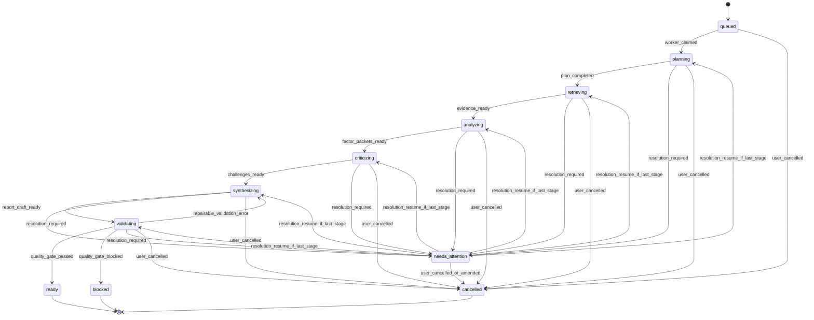
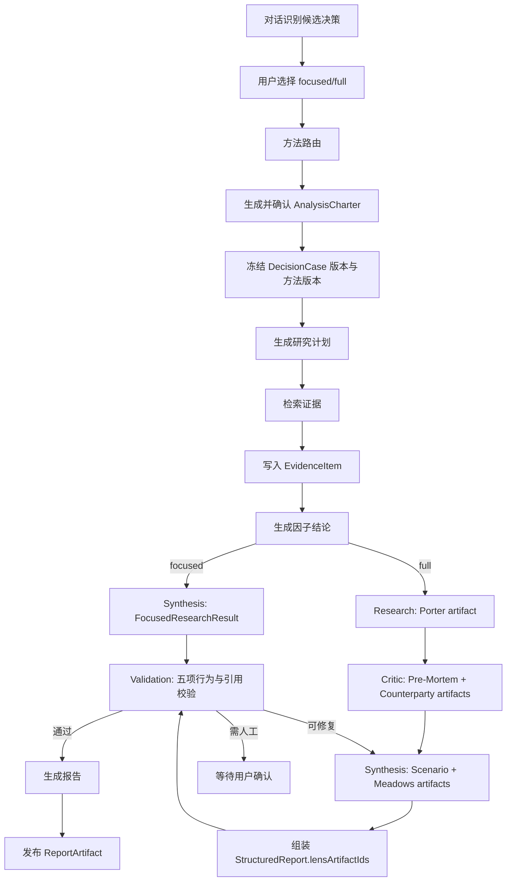

# 07. Agent 工作流

## 设计原则

Agent 在 Ludus 中是分析执行机制，不是以数量取胜的产品卖点。正式 `AnalysisRun` 保留四类执行 Worker：Research、Critic、Synthesis、Validation；Validation Worker 内由一个 `ValidationOrchestrator` 执行九个隔离、版本化 Validator Contract，不把它们扩张成九个常驻服务或九票表决。Safety Anchor 是 Critic 的强制子阶段；Discussion Assistant、Method Router、Cynefin Gate 和 Simulation Engine 是独立服务，不计入正式分析 Worker。每个 Worker 只读冻结 `RunManifest` 并写结构化 Run 产物，前端展示角色、目标、状态、工具摘要、证据、产物和事件，不展示模型不可验证的内部思维过程。

检索 Worker 只调用稳定工具名，不直接调用 Exa、Firecrawl 或 Tavily 的专有工具。Connector Registry 根据 Workspace 授权、可用性和预算选择 Provider；所有外部结果先写 `RawArtifact`，再经过信息质量门。

Hermes 的 `hermes-agent-hermes-hermes-a8a19433/run_agent.py`、`hermes-agent-hermes-hermes-a8a19433/model_tools.py`、`hermes-agent-hermes-hermes-a8a19433/tools/registry.py`、`hermes-agent-hermes-hermes-a8a19433/agent/context_compressor.py` 和 `hermes-agent-hermes-hermes-a8a19433/tools/delegate_tool.py` 提供了可借鉴的执行思路：主循环有迭代预算和错误处理，工具通过注册表统一分发，上下文压缩保护关键状态，子任务有并发和深度限制。

P0 进一步适配 Hermes 已有机制：

- `tools/registry.py`：单一工具注册表，保存 schema、handler、toolset、availability 和环境要求。
- `tools/delegate_tool.py`：子任务使用隔离上下文；工具权限是父任务权限的子集；限制并发、深度和迭代；只返回结构化摘要与 tool trace。
- `tools/mcp_tool.py`：借鉴 schema 转换、名称前缀、超时、错误清洗、动态刷新和连接生命周期；P0 仍只允许审核目录只读来源。
- `agent/skill_utils.py`：Method/Skill Loader 读取 frontmatter、版本和内容哈希，按已发布目录加载，不在运行中自动发明技能。

## AnalysisRun 状态机



`needs_attention` 不是通用编辑入口。进入时必须持久化 `lastResumableStage`，只有 append-only `RunResolution` 才能恢复到该精确阶段，禁止统一回到 `queued`。`blocked` 是质量门终态，不能恢复；要重做必须创建新 Run。`cancelled` 是终态，Worker 在安全检查点停止且不得再发布产物，已完成事件和不可变阶段产物继续保留。

confirmed Charter 永不修改。运行中输入先产生 `RunInterventionClassification`：已冻结范围内的来源冲突裁决、既有硬约束确认、以及在 Charter 已授权集合内的 Provider 恢复可以归类为 resolution；改变问题、目标、选项、偏好权重、材料/连接器范围、预算、方法或深度一律是 amendment。amendment 必须创建 replacement Charter 和 new Run，旧 Run 取消并通过 supersession 字段关联，不能原地续跑。

## Case 决策生命周期与 Cynefin 前置门

`AnalysisRun` 子状态机不替代 Case 的决策生命周期。Case 必须使用：

```text
draft → scoped → ready → running → review → pending_signoff → decided → monitoring
```

- `draft → scoped`：人类确认问题、目标、责任人和边界；
- `scoped → ready`：服务端完成输入与 Cynefin gate 检查，或冻结有理由的人类 override；
- `ready → running`：创建不可变 `RunManifest` 与正式 Run；
- `running → review`：qualifying Run ready，且结构化结果可供人审阅；
- `review → pending_signoff`：人类显式请求签署；
- `pending_signoff → decided`：只能由授权人类通过 sign command；
- `decided → monitoring`：人类启用指标、阈值和复盘计划。

`blocked/needs_attention/cancelled/reopened/archived` 是 operational status 或 Run 状态。Worker、模型、fixture 和管理员后台都不得自动进入 `decided`。

Cynefin gate 在 formal Run 之前执行并冻结到 Charter/RunManifest：clear 默认 quick；complicated 默认 focused；complex 允许 focused/full 且要求 safe-to-fail probes；chaotic 先稳定、默认阻断长分析；disorder 阻断并要求补充边界。任何 override 必须由人类提交理由并产生 append-only 事件。

## Worker 角色

| 角色 | 输入 | 输出 | 失败处理 |
|---|---|---|---|
| Research Worker | 冻结的 CaseVersion、研究计划 | `EvidenceItem`、`ResearchPacket`；full 另产出 Porter `StrategicLensArtifact` | 搜索失败时用缓存或标记资料不足；Porter 五力缺项则 full 不进入综合 |
| Critic Worker | 研究包、选项、假设、Porter artifact | `Challenge`、脆弱假设、冲突列表；full 另产出 Pre-Mortem 与 Counterparty 两个独立 artifact | 输出结构不合格则重试一次；两个 lens 不能互相替代 |
| Synthesis Worker | 证据、研究、挑战、偏好、上游 lens 和 analysisLevel | focused 输出 `FocusedResearchResult`；full 产出 Scenario 与 Meadows 两个独立 artifact 后组装 `StructuredReport` | 冲突未解释或 lens 缺失则返回校验失败 |
| Validation Worker | `JudgmentSet`、`DissentRecord`、`DraftRecommendation`、报告草稿、五个 lens artifact 与引用链 | 九个 `ValidatorResult`、质量门结果、命名修复目标 | 一个编排器执行 V1-V9；blocker fail-closed；只验证、不补写缺失 lens，不自动发布不合格结果 |

日常对话由 Discussion Assistant 生成候选条目和 `QuickAnalysisResult`；Method Router 只为 focused/full 选择正式方法；Simulation Engine 是确定性纯函数。三者都不进入上述 Worker 状态机。

focused/full 的 Critic 都必须执行 Safety Anchor 检查：主流叙事回声、集体盲点、反例缺失和跨 Agent 伪收敛。该步骤写入同一个 Critic packet，避免在文档中同时出现“四 Worker”和额外正式角色；full 只增加覆盖和预算，不改变该硬要求。

## Full 战略透镜职责

五项 lens 只属于 `full`，并按 `06-data-model.md` 持久化为五个 Workspace-scoped、不可变 `StrategicLensArtifact`。它们不是报告章节、Prompt 临时文本或新 Worker：

| Lens | 固定 producerRole | 行为完成条件 |
|---|---|---|
| `porter_five_forces` | Research | 对至少两个市场分别界定行业边界；每个市场完整五力且每力至少两个 Evidence、趋势方向；单列监管/变化与战略含义，分数不得成为决策公式 |
| `pre_mortem` | Critic | internal/external/systemic_hindsight 三视角，至少 5 个 cause，严格 top 3 分别给 prevention/contingency/detection，并输出 `continue/modify/abandon/validate_first` |
| `counterparty_response_matrix` | Critic | 只选 1-2 个关键 actor；2-3 个可观察行动且含唯一 no-action；逐 actor/action 给 optimal/worst/likely response、window、我方再回应、publication test、downside asymmetry 与 reflexivity |
| `scenario_planning` | Synthesis | 分离 predetermined elements 和 high-impact/high-uncertainty，选择两个 axis；形成 3-4 个结构不同情景，含 timeline、stakeholder states、early warnings 和 strategy resilience，至少一个策略被一个情景 `killed` |
| `meadows_leverage_points` | Synthesis | 映射 stocks/flows、强化/平衡回路、delays、rules/incentives；覆盖至少三个层级，识别被忽略的 1-4 高杠杆空缺、失控强化回路、高杠杆副作用与干预顺序 |

`AnalysisCharter.requiredStrategicLensTypes` 在 confirmed 时冻结：focused 必须为空，full 必须是五项完整集合。运行中不得让模型、用户或 Worker动态增删 lens；任何集合变化都是 `strategic_lens_set` amendment，必须 replacement Charter + new Run。Artifact 只消费该 Run 的冻结快照与已持久化上游产物，写入后不可覆盖；相同 Run/lens 的幂等重放只有 `contentHash` 相同时可返回已有对象。

每个 lens 完成后写 `strategic_lens.completed` 事件，payload 只含 artifact ID、lensType、producerRole、引用计数和内容哈希，不内联完整内容或隐藏思维。Validation 必须验证五项集合、角色映射、同 Workspace/Run/Charter/方法快照、引用存在性和上述行为完成条件；缺失或行为退化时 full Run 不能 ready。

读取同样遵守最小上下文：list API 只返回 canonical 顺序的 `StrategicLensArtifactSummary[]`，含 ID/type/producer/status、引用计数、版本/hash/origin/createdAt，不含 `content` 或 `researchRequests`；只有按 ID 的 item API 返回完整 `StrategicLensArtifact` 判别联合。Worker/Validation 必须从 repository 读取完整 artifact，不能把 list summary 当作行为校验输入。

## 工具注册

P0 工具注册表采用 Hermes `tools/registry.py` 的思想：工具声明 schema、可用性检查、handler 和错误格式。所有工具返回 JSON，不直接写 UI。

```ts
interface DecisionTool<TArgs, TResult> {
  name: string;
  description: string;
  schema: unknown;
  available(): Promise<boolean>;
  run(args: TArgs, ctx: ToolContext): Promise<TResult>;
}
```

P0 工具清单：

| 工具 | 用途 |
|---|---|
| `case_read` | 读取指定版本 `DecisionCase` |
| `dossier_candidate_propose` | 提交候选档案变更，不能直接修改 confirmed 条目 |
| `method_route` | 从已发布方法 manifest 中推荐方法并返回结构化理由 |
| `evidence_search` | 搜索或读取缓存证据 |
| `evidence_add` | 写入证据账本 |
| `report_render_html` | 从结构化报告生成 HTML |
| `report_export_pdf` | 用 Playwright 生成 PDF |
| `simulation_generate_graph` | 从报告生成因果图草稿 |
| `simulation_run` | 执行情景和敏感性计算 |

工具注册表 MUST NOT 注册 `sign_decision`、`transition_to_decided`、`decision_record_update` 或任何等价能力。最终签署只能由独立的人类鉴权 API command 执行；Worker 即使收到提示注入也没有该工具和数据库权限。
## 九项 Validator Contract

P0 使用一个 Validation Worker 和一个 `ValidationOrchestrator`，执行精确集合：

```text
V1_scope_charter
V2_source_traceability
V3_evidence_quality
V4_claim_evidence_entailment
V5_contradiction_alignment
V6_unknown_assumption
V7_adversarial_dissent
V8_causal_simulation
V9_publication_authority
```

V1/V2/V3/V8/V9 优先使用确定性代码；V4/V5/V7 可由 provider-neutral 模型辅助；V6 为混合检查。每项输出 strict JSON，结果只用 `pass|warn|block`。任何 blocker 阻止 Run ready 或 Report publication，不允许按多数票覆盖。配置的 provider-neutral 语义模型可用于语义校验，但不得决定授权、签署、状态转换、FK、Workspace scope 或 append-only 规则。

## DeepSeek V4 Pro transient reasoning

官方 thinking mode 默认启用并返回 `reasoning_content`。若 assistant turn 发起 tool call，Provider adapter 在后续工具回传轮次必须把该字段原样带回官方 API；Ludus 只允许它存在于这一次 Provider 调用链的内存态 transient envelope。它不得进入数据库、日志、`AnalysisEvent`、tool trace、上下文压缩、报告或 UI，不属于 canonical 用户可审计数据。没有 tool call 时立即丢弃；调用链或 Run 中断后也不恢复，Worker 从最后一个已持久化的结构化阶段重新发起。

官方 strict tool calls 可用于 thinking 与 non-thinking。JSON Output 返回空 `content` 时必须判为结构失败，并按现有规则执行至多一次 schema 修复/重试；不能把 `reasoning_content` 当作缺失结构化结果的替代品。

工具错误示例：

```json
{
  "ok": false,
  "errorCode": "TOOL_UNAVAILABLE",
  "message": "evidence_search 当前不可用，已切换到缓存证据",
  "retryable": false,
  "fallbackUsed": "cached_evidence"
}
```

## AnalysisRun 研究阶段



## 人工确认点

必须请求用户确认的节点：

- 决策问题和目标被系统重写后。
- 方法路由完成、正式分析契约冻结前。
- 系统识别的硬约束影响推荐时。
- 来源冲突会改变主建议时。
- 自动生成的因果图写回档案前。
- 最终决定保存前。

人工确认不需要阻断所有任务。非关键证据补充、报告草稿生成、沙盘试算可以继续。

## 上下文压缩

Hermes 的 `agent/context_compressor.py` 通过保护前置消息、尾部上下文和工具调用一致性来压缩长会话。Ludus P0 使用更产品化的方式：把聊天历史压缩成 `CaseSummary`，并把结构化内容写为候选档案条目；用户确认后再进入 Case 或主体长期档案。

压缩输出必须包含：

- 当前决策问题。
- 用户目标和硬约束。
- 已确认事实。
- 关键假设。
- 未解决未知项。
- 当前选项和分歧。
- 最近用户修改。
- 下一步动作。

模型后续不依赖完整聊天历史做关键判断，而是读取 `DecisionCase` 和最近消息。

## 子任务边界

参考 `hermes-agent-hermes-hermes-a8a19433/tools/delegate_tool.py` 的限制思路，Ludus 的子任务规则：

- 最多 3 个并行 Worker。
- 子任务不能再派生子任务。
- 子任务不能直接向用户提问，只能返回 `needs_user_input`。
- 子任务不能修改最终决定，只能提交结构化补丁。
- 父任务只接收结构化结果、摘要和错误，不展示内部推理。

## 重试策略

| 错误 | 重试 | 处理 |
|---|---|---|
| 网络超时 | 是 | 指数退避，最多 2 次 |
| 模型 429/5xx | 是 | 按 Provider 策略延迟重试；P0 不自动切换未配置模型 |
| JSON 结构错误 | 是 | 用 schema 修复提示重试一次 |
| 引用缺失 | 否 | 进入 `validating` 失败，要求补证据 |
| 用户输入不足 | 否 | 路由阶段返回 `partial`；运行中仅可 resolution 的缺口进入 `needs_attention`，冻结字段缺口走 amendment + new Run |
| PDF 渲染失败 | 是 | 重试一次，失败则保留 HTML 并标记 PDF 未生成 |
| 搜索不可用 | 否 | 使用缓存证据或降级预置案例 |

## 失败恢复

每个阶段完成后写入 `analysisRun.stageResults`：

```json
{
  "analysisRunId": "run_research_001",
  "decisionCaseId": "case_spherical_robot",
  "caseVersion": 3,
  "stage": "synthesis",
  "completedStages": ["plan", "retrieve", "factor_analysis", "critic"],
  "lastResumableStage": "synthesizing",
  "lastEventId": "evt_045"
}
```

Worker 重启后读取活动状态且 `heartbeatAt` 超时的 Run，将其标记为 `needs_attention`，检查幂等键和已完成阶段。服务端只接受 `06-data-model.md` 的三类 resolution payload；追加 resolution 后状态直接恢复为 `lastResumableStage`。如果输入改变 Charter 冻结字段，返回 amendment 分类并引导 replacement Charter，绝不修改原 Run 输入。

## 质量门

报告发布前必须通过：

- 每个主要判断至少有证据或明确标记为假设。
- 每个来源有等级、时间和 URL/文件路径。
- 冲突来源有解释。
- 反方审查不为空。
- 推荐包含条件、阈值、退出条件、领先指标和复盘日期。
- 没有把沙盘结果表达为精确预测。
- full 已持久化五项独立 StrategicLensArtifact，角色映射、行为、证据/假设引用和 `StructuredReport.lensArtifactIds` 均通过校验；focused 不创建 lens artifact。

质量门失败时不发布 PDF，只显示草稿和失败原因。

## 开发多智能体执行边界

产品运行时的 Research/Critic/Synthesis/Validation 与开发工作流 Agent 必须继续分离。开发 Agent 的任务、依赖、write scope、验收和 handoff 由 `agent-work-manifest.yaml` 定义；同一路径同时只能有一个 owner。QA/Release 只创建测试、trace、截图和 defect handoff，不直接修改其他 owner 的产品源码。schema/API/事件变化必须提交 CCR 并由 Contract Lead 生成 OpenAPI/TypeScript 合同后再继续。

## Web 可见事件投影

参考 Open WebUI 的 message-scoped status、task、tool call、citation 和 confirmation 交互，Ludus 将持久化 `analysis_events` 投影为：

| 事件类别 | 用户看到 | 不展示 |
|---|---|---|
| `agent.status` | Worker 角色、阶段、进度、开始/完成/错误 | 内部思维链 |
| `agent.task` | 子任务目标、状态、耗时、产物数量 | 子 Agent 完整上下文 |
| `tool.call` | 稳定工具名、用途、状态、来源模式、结果摘要 | 密钥和不必要的原始正文 |
| `citation.added` | Evidence 标题、等级、适用范围和关联命题 | 无权限原文 |
| `user.confirmation.required` | 阻塞原因、选项和恢复动作 | 模型要求用户盲目批准的自由文本 |

前端保留每个消息/Run 的 `statusHistory`，支持取消、SSE 重连和历史重放；数据库事件仍是正式状态源。
