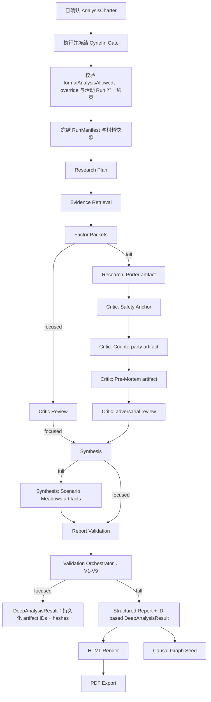

# 08. 深度研究流水线

## 接入目标

深度决策报告模式使用已经从 `探讨` 模式二沉淀出的 `ways/hardtech-market-direction/1.1.0`，并以 Ludus 的已确认 `AnalysisCharter`、冻结的 Case/档案快照、`AnalysisRun` 事件和报告对象为中心执行。P0 不复制原临时项目目录，而是实现可演示、可校验、可降级的最小深度研究链路。

首个方法源已由 `framework-selector` v6.12.x、`v6-rag-pool`、`v6-analysis-agent`、`v6-safety-anchor`、`v6-strategy-synthesis`、`v6-chief-of-staff`、`v6-devils-advocate` 和 `analysis-quality-gate` 提炼完成，不重新发明等价 Prompt。安装器记录来源技能路径与版本，并对规范化包内容计算 SHA-256；正式运行只使用安装到 `method-packs` 的不可变 `published` 副本。

## 现有模式二结构

从本地文件可确认的关键结构：

- `探讨/skills/research/framework-selector/SKILL.md` 定义了完整分析流程和项目目录结构。
- `探讨/skills/research/full-mode-composer/SKILL.md` 要求报告生成前检查事实卡、方向确认、因子结论和综合文件。
- `探讨/skills/research/v6-rag-pool/SKILL.md` 定义共享 RAG 池、任务优先级和来源分级。
- `探讨/skills/research/v6-analysis-agent/SKILL.md` 定义因子结论结构。
- `探讨/skills/research/v6-safety-anchor/SKILL.md` 定义盲点和脆弱环节报告。
- `探讨/skills/research/v6-strategy-synthesis/SKILL.md` 定义综合判断和残余不确定性。
- `探讨/skills/research/v6-devils-advocate/SKILL.md` 定义反方审查。
- `探讨/templates/01_research_report/template.html` 和 `探讨/templates/01_research_report/template.tex` 说明报告模板已经存在。

这些路径只用于来源审计。运行时不得回读 `探讨`，也不得直接执行 `ways` 中的 `release_candidate`；唯一执行入口是通过校验、哈希和发布状态检查的 `method-packs/hardtech-market-direction/1.1.0`。

## DeepSeek V4 Pro 执行合同

Gate 0 不只探测模型名存在，还必须分别验证最小文本调用、thinking、strict tool call、JSON/structured output、空 `content` 行为和 API 返回模型标识。当前默认 `deepseek-v4-pro` 保留；若账号能力或 API 行为与合同不符，必须在计时前选择经探测的模型映射并回写环境默认值，不能在运行中静默切换语义。

P0 默认值为 `MODEL_PROVIDER=deepseek`、`MODEL_BASE_URL=https://api.deepseek.com`、`MODEL_NAME=deepseek-v4-pro`，使用 DeepSeek 官方 API 和 OpenAI-compatible Provider Adapter。环境可以覆盖这些值，但业务代码、方法包和 Worker 只能依赖 `ModelProvider`，不能直接依赖 DeepSeek 私有 SDK 或供应商工具名。

Research、Critic、Synthesis、Validation 四类 Worker 可以共享 DeepSeek V4 Pro 基座，但必须隔离上下文、Prompt、阶段产物、预算、事件和 tool trace。thinking mode 的 `reasoning_content` 仅在同一次官方工具调用链的内存态信封中保留并按协议回传；没有工具调用、调用结束或 Run 中断时立即丢弃，且永不进入数据库、日志、事件、trace、报告或 UI。JSON Output 的空 `content` 必须作为结构失败处理，最多执行一次 schema 修复重试，不能用 `reasoning_content` 替代正式结构化结果。

## P0 流水线



## Run Manifest、Cynefin 与 Agent Engine 边界

正式分析不是“问一句回一句”。API 先接收 `DeepAnalysisRequest`，从 confirmed Charter、Case/Dossier 快照和材料快照生成不可变 `RunManifest`。manifest 至少冻结：Workspace/Case/Charter 版本、快照哈希、SourceRecord/内容哈希、分析深度、方法 ID/版本/哈希、预算、允许工具、允许连接器、CynefinGateResult 与幂等键。

Cynefin gate 规则：

- `clear`：默认 quick，正式 focused 需要理由；
- `complicated`：默认 focused，高风险或不可逆可 full；
- `complex`：允许 focused/full，必须列 safe-to-fail probes 和 review triggers；
- `chaotic`：先执行稳定动作，默认不启动长分析；
- `disorder`：阻断，补全边界后重新判定。

override 只能由人类提交并写入 Charter/RunManifest。模型不能自我覆盖 gate。

正式结果是 ID-based `DeepAnalysisResult`，必须返回已持久化 `JudgmentSet`、`DissentRecord`、`DraftRecommendation`、QualityGateResult 的 ID，以及未解决 Unknown、九个 ValidatorResult、RunManifest/provenance hash；不得内嵌第二套 DTO。自然语言报告只从这些结构化对象渲染。正式 request schema 禁止 `messages[]` 主字段；讨论消息只能先转成经人确认的 Case/Charter/pre-run Source；创建 Run 时再冻结为 run-frozen Source/Span 快照。

## 输入结构

`AnalysisRun` 输入是已确认且允许正式分析的 `AnalysisCharter`，其中引用不可变的 Case/档案快照。以下仅展示执行器读取的关键字段摘录，不是第二套 schema；完整 `AnalysisCharter` 与 `AnalysisRun` 合同以 `06-data-model.md` 为准：

```json
{
  "id": "run_001",
  "charterId": "charter_001",
  "charterVersion": 1,
  "status": "queued",
  "originModes": [],
  "formalAnalysisAllowed": true,
  "analysisLevel": "full",
  "requiredStrategicLensTypes": [
    "porter_five_forces",
    "pre_mortem",
    "counterparty_response_matrix",
    "scenario_planning",
    "meadows_leverage_points"
  ],
  "methodId": "hardtech-market-direction",
  "methodVersion": "1.1.0",
  "methodReasons": ["硬科技产品在有限资源下进行市场进入方向比较，符合首个正式方法包的适用边界。"],
  "caseSnapshotHash": "sha256:fixture-spherical-robot-v3",
  "decisionCaseId": "case_spherical_robot",
  "caseVersion": 3,
  "decisionQuestion": "资金与研发资源有限时，球形机器人应该优先进入救援市场还是家庭服务市场？",
  "goals": [
    { "metric": "有效试点", "target": "6 个月内形成至少 2 个可验证试点", "weight": 0.4 },
    { "metric": "现金消耗", "target": "不突破 9 个月现金窗口", "weight": 0.25 }
  ],
  "constraints": [
    { "text": "只能优先投入一个市场方向", "hard": true }
  ],
  "knownFacts": ["已有可运行的球形机器人原型", "续航、载荷和复杂地形能力仍需场景验证"],
  "assumptions": ["救援机构愿意为远程侦察能力进入正式采购流程"],
  "options": ["救援市场试点", "家庭服务市场试点", "继续研究后再决定"]
}
```

`requiredStrategicLensTypes` 来自 confirmed Charter。focused 必须为空，full 必须是 canonical 五项完整集合；集合、顺序规范化结果和方法/快照引用一起冻结。运行中要求增加、删除或替换 lens 会产生 `strategic_lens_set` amendment，必须 replacement Charter + new Run，不能把它当作报告修订或 `RunResolution`。

## 研究计划输出

```json
{
  "researchPlanId": "rp_001",
  "decisionCaseId": "case_spherical_robot",
  "factors": [
    {
      "id": "factor_rescue_demand",
      "name": "救援需求与采购可达性",
      "framework": "Jobs-to-be-Done + 证据强度评估",
      "queries": ["search and rescue ground robot procurement cycle", "emergency response reconnaissance robot buyer requirements"]
    },
    {
      "id": "factor_technical_safety",
      "name": "技术成熟度与安全责任",
      "framework": "风险矩阵",
      "queries": ["search rescue robot terrain reliability safety requirements"]
    }
  ],
  "mustAnswer": [
    "什么证据能证明救援需求可以进入预算和采购流程？",
    "最可能导致项目失败的假设是什么？",
    "推荐在哪些阈值下成立？"
  ]
}
```

## 证据检索与引用

P0 支持三种来源：

- 在线检索：默认 Exa 搜索、Firecrawl 抓取，Tavily 仅作为备用；结果先写 `RawArtifact`，质检后才写入 `EvidenceItem`。
- 用户来源：审核目录中的 BYOK 只读连接器和用户上传文件。
- 缓存证据：演示失败时加载预置 JSON，不伪造为实时搜索。

每条 RawArtifact、EvidenceItem 保存单值 `originMode`；事件保存直接 `originMode` 与阶段聚合的 `sourceOriginModes[]`；focused/full ReportArtifact 和 ExportArtifact 保存去重后的 `originModes[]`：

- `live`：本次 Run 真实调用模型或连接器获得。
- `cached`：读取此前真实抓取且内容哈希未变的材料。
- `fixture`：外部服务不可用且用户明确同意后加载的 deterministic fixture。

fixture 只替代外部输入，后续信息质检、Worker、报告 schema、HTML/PDF、沙盘和版本流程仍真实执行。

免费额度下先用 Exa 找到 10-20 个候选来源，去重和初筛后只让 Firecrawl 抓取 3-8 个高价值页面。Agent 调用 `search_web`、`fetch_url`、`crawl_site`、`extract_document` 和 `get_source_status`，不直接依赖供应商工具名。

证据写入示例：

```json
{
  "id": "ev_012",
  "title": "Rescue organization interview summary: remote reconnaissance",
  "url": null,
  "filePath": "workspaces/ws_demo/uploads/raw_rescue_interviews.md",
  "sourceGrade": "L1_primary",
  "snippet": "3 of 5 interviewed rescue teams identified pre-entry remote reconnaissance as a recurring operational need.",
  "retrievedAt": "2026-07-10T15:00:00+08:00",
  "freshnessStatus": "fresh",
  "relevance": 0.86,
  "supportsClaimIds": ["claim_rescue_need"]
}
```

## 因子结论结构

结构参考 `探讨/skills/research/v6-analysis-agent/SKILL.md`，但字段名统一到产品模型：

```json
{
  "id": "packet_rescue_demand",
  "role": "research",
  "factor": "救援需求与采购可达性",
  "frameworkUsed": "Jobs-to-be-Done + evidence strength",
  "conclusion": "救援团队对危险区域远程侦察有明确需求，但预算归属和采购周期仍未被充分验证。",
  "direction": "supports_rescue_pilot_conditionally",
  "claimSupportScore": 0.64,
  "evidenceIds": ["ev_012", "ev_013"],
  "discardedClaims": ["机器人行业增长不能直接证明救援机构会采购本产品"],
  "remainingGaps": ["缺少采购负责人对预算来源和采购周期的确认"],
  "disclaimer": "结论适用于当前访谈覆盖的救援团队，不代表全部地区和机构。",
  "createdAt": "2026-07-10T15:14:00+08:00"
}
```

## 批判与安全锚点

批判输出合并 `探讨/skills/research/v6-devils-advocate/SKILL.md` 和 `探讨/skills/research/v6-safety-anchor/SKILL.md` 的思路：

```json
{
  "criticPacketId": "critic_001",
  "challenges": [
    {
      "category": "core_assumption",
      "text": "一线救援需求不等于采购部门会在现金窗口内立项。",
      "severity": "high",
      "affectedOptionIds": ["opt_rescue_pilot"],
      "mitigation": "取得至少 2 个采购方或试点负责人的书面意向，并确认预算路径"
    },
    {
      "category": "fatal_flaw",
      "text": "若原型无法在烟尘、碎石和通信受限环境中稳定运行，救援方向不具备最低交付条件。",
      "severity": "critical",
      "mitigation": "先执行复杂地形、续航和失联保护测试，未达门槛则阻断正式试点"
    }
  ],
  "ifAllWrongBecause": "团队把一线人员表达的使用兴趣误读为机构采购承诺。"
}
```

## 五项战略透镜流水线

五项 lens 使用 `06-data-model.md` 的判别联合，各自写入一个独立 `StrategicLensArtifact`，不能只作为 `StructuredReport.sections` 中的标题或临时 Prompt 文本。固定职责和依赖如下：

```text
ResearchPacket + Evidence Ledger
├── Research -> Porter Five Forces
└── Critic inputs
    ├── Critic -> Pre-Mortem
    ├── Critic -> Counterparty Analysis
    └── Synthesis inputs
        ├── Synthesis -> Scenario Analysis
        └── Synthesis -> Meadows Leverage Points
            -> StructuredReport.lensArtifactIds
            -> Validation
```

行为要求：

- **Porter**：对至少两个市场选项分别冻结行业边界并逐项完成标准五力；每力至少两个 Evidence、1-5 序数 threat、变化方向和 reasoning，另有 changing trend、regulatory assessment、complementors、跨市场比较和条件化战略含义。`averageThreatScore` 只作描述，不能成为决策公式或抵消 fatal gate。
- **Pre-Mortem**：以明确未来时点和既成失败状态开场，固定 internal/external/systemic_hindsight 三视角，至少 5 个具体 cause；严格 top 3 分别给 prevention、contingency、detection indicator，最后输出 `continue | modify | abandon | validate_first` 与额外信息需求。普通风险清单不合格。
- **Counterparty Response Matrix**：只选 1-2 个最关键 actor；定义 2-3 个可观察我方行动且恰好一个 no-action。每个 actor/action 只推演一层 optimal/worst/likely response、response window、optimal-likely gap、我方 counter-response、fallback cost 和失效判断；另做 publication test、downside asymmetry、退出成本与 reflexivity warning。
- **Scenario Planning**：分离 predetermined elements 与关键不确定性，选择两个 high-impact/high-uncertainty axis；形成 3-4 个结构不同情景，其中恰好一个 baseline、至少两个 structural break。每个情景含 timeline、至少三个 stakeholder states、3-5 个 early warnings；逐选项测试 resilience，至少一个策略在一个情景中为 `killed`。它不包含概率，也不是沙盘 `ScenarioVersion`。
- **Meadows**：完整映射 boundary、stated/actual goal、stocks、flows、reinforcing/balancing loops、delays、actors、rules/incentives；当前干预覆盖至少三个层级，识别至少一个被忽略的 1-4 高杠杆空缺、至少一个可能失控的强化回路、干预顺序和高杠杆副作用/破坏风险。只列普通行动不合格。

Artifact 先于 `StructuredReport` 持久化。每个 lens 完成时写 `strategic_lens.completed`，随后 Synthesis 只把五个 ID 写入报告；报告不复制五份内容。Validation 从 repository 重新读取这些 ID，验证同 Workspace/Case/Run/Charter/方法快照、固定角色映射、引用存在和行为要求；不能信任模型在报告里自称“已完成透镜”。

## 持久化与读取 API

Postgres 表 `strategic_lens_artifacts` 按 `06-data-model.md` 保存明确列 `id/workspace_id/decision_case_id/analysis_run_id/charter_id/lens_type/producer_role/schema_version/content_hash/created_at`，复杂 content 与 provenance 使用 JSONB，证据/假设/挑战引用仍需应用层和外键可达性校验。`(workspace_id, analysis_run_id, lens_type)` 唯一；记录不可更新或删除，重做创建 new Run。

Worker 只通过内部 repository 写入，不开放 POST/PATCH/DELETE。用户可见读取合同：

- `GET /api/workspaces/{workspaceId}/analyses/{analysisRunId}/strategic-lenses`：按 Porter、Pre-Mortem、Counterparty、Scenario、Meadows 顺序返回 full Run 的 `StrategicLensArtifactSummary[]`；仅含 ID/type/producer/phase/status、引用计数、版本/hash/origin/createdAt，不含 `content` 或 `researchRequests`。
- `GET /api/workspaces/{workspaceId}/analyses/{analysisRunId}/strategic-lenses/{artifactId}`：返回精确、完整的 `StrategicLensArtifact` 判别联合，包含 resolved reference ID、research requests 与 lens-specific content。

端点使用统一响应信封。跨 Workspace、artifact 不属于 URL 中 Run、Run 不属于 Workspace 或 ID 枚举统一 `404`。focused Run 返回空列表且不能存在 artifact；full 尚未完成时列表可返回当前已持久化子集及 Run 状态，但报告只有五项全部 ready 后才能发布。读取不重新调用模型，也不从 `StructuredReport` 反向重建 artifact。

## 综合报告结构

`focused` ready Run 生成 `FocusedResearchResult`，只交付执行简报、结构化建议、证据账本、反方与剩余未知；不生成 PDF 或正式沙盘。以下完整 `StructuredReport` 只属于 `full` ready Run，是详细 HTML、PDF 和沙盘的共同输入。blocked Run 只保留明确草稿状态和修复动作；full 可额外渲染带草稿水印的 HTML，不生成 PDF 或正式沙盘：

```json
{
  "schemaVersion": "1.0.0",
  "methodId": "hardtech-market-direction",
  "methodVersion": "1.1.0",
  "methodContentHash": "sha256:...",
  "lensArtifactIds": [
    "lens_porter_001",
    "lens_pre_mortem_001",
    "lens_counterparty_001",
    "lens_scenario_001",
    "lens_meadows_001"
  ],
  "executiveBrief": {
    "decision": "满足采购周期和技术门槛时优先推进救援市场试点，否则继续研究。",
    "whyNow": "救援需求信号较强，但采购可达性和复杂环境可靠性仍需验证。",
    "conditions": [
      "完成至少 6 个救援机构访谈",
      "至少 2 个提供试点意向或测试场地"
    ],
    "thresholds": [
      {
        "metric": "预计采购周期",
        "operator": "<=",
        "value": "12 个月",
        "actionIfMissed": "停止救援市场正式试点并继续研究"
      },
      {
        "metric": "复杂地形与任务续航测试",
        "operator": "=",
        "value": "通过试点门槛",
        "actionIfMissed": "先修复可靠性问题，不进入采购验证"
      }
    ],
    "exitCriteria": [
      "采购周期超过现金窗口",
      "关键地形或安全测试未达标"
    ],
    "reviewDate": "2026-10-15"
  },
  "situation": {
    "title": "背景与决策问题",
    "summary": "团队资源只允许优先验证一个市场方向，需要在救援、家庭服务和继续研究之间作出可复盘选择。",
    "claimIds": [
      "claim_context",
      "claim_resource_constraint"
    ],
    "evidenceIds": [
      "ev_001"
    ]
  },
  "sections": [
    {
      "title": "需求与采购可达性",
      "summary": "救援团队存在远程侦察需求，但预算归属和采购周期尚未被充分验证。",
      "claimIds": [
        "claim_rescue_need",
        "claim_procurement_gap"
      ],
      "evidenceIds": [
        "ev_012",
        "ev_013"
      ]
    },
    {
      "title": "技术与安全门槛",
      "summary": "复杂地形可靠性、续航和失联保护是正式试点的前置条件。",
      "claimIds": [
        "claim_technical_gate",
        "claim_safety_gate"
      ],
      "evidenceIds": [
        "ev_020",
        "ev_021"
      ]
    }
  ],
  "options": [
    {
      "optionId": "opt_rescue_pilot",
      "summary": "在采购和技术门槛满足后推进救援市场试点。",
      "benefits": [
        "用户痛点明确",
        "试点价值可通过任务指标验证"
      ],
      "risks": [
        "采购周期可能超过现金窗口",
        "复杂环境可靠性尚未达标"
      ]
    },
    {
      "optionId": "opt_home_service_pilot",
      "summary": "转向家庭服务场景验证。",
      "benefits": [
        "潜在用户范围更广"
      ],
      "risks": [
        "需求分散",
        "安全和成本要求未必更低"
      ]
    },
    {
      "optionId": "opt_continue_research",
      "summary": "暂不进入正式试点，先补齐采购和技术证据。",
      "benefits": [
        "降低错误押注成本"
      ],
      "risks": [
        "延迟市场学习",
        "持续消耗现金"
      ]
    }
  ],
  "evidenceReview": {
    "evidenceIds": [
      "ev_001",
      "ev_012",
      "ev_013",
      "ev_020",
      "ev_021"
    ],
    "conflictGroupIds": [
      "conflict_procurement_cycle"
    ],
    "freshnessWarnings": [
      "家庭服务方向的一手访谈覆盖不足"
    ]
  },
  "counterArguments": [
    {
      "id": "challenge_core_assumption",
      "category": "core_assumption",
      "text": "一线救援需求不等于采购部门会在现金窗口内立项。",
      "severity": "high",
      "affectedOptionIds": [
        "opt_rescue_pilot"
      ],
      "evidenceIds": [
        "ev_012",
        "ev_013"
      ],
      "mitigation": "取得至少 2 个采购方或试点负责人的书面意向，并确认预算路径。",
      "status": "confirmed"
    },
    {
      "id": "challenge_technical_gate",
      "category": "fatal_flaw",
      "text": "原型若不能在复杂环境中稳定运行，救援试点不具备最低交付条件。",
      "severity": "critical",
      "affectedOptionIds": [
        "opt_rescue_pilot"
      ],
      "evidenceIds": [
        "ev_020",
        "ev_021"
      ],
      "mitigation": "先完成复杂地形、续航和失联保护测试。",
      "status": "confirmed"
    }
  ],
  "recommendation": {
    "outcome": {
      "kind": "option",
      "optionId": "opt_rescue_pilot"
    },
    "alternativeOptionIds": [
      "opt_continue_research",
      "opt_home_service_pilot"
    ],
    "summary": "仅在采购周期和技术门槛同时满足时推进救援市场试点，否则选择继续研究。",
    "conditions": [
      "至少 2 个机构确认试点或采购路径",
      "关键可靠性与安全测试达标"
    ],
    "thresholds": [
      {
        "metric": "预计采购周期",
        "operator": "<=",
        "value": "12 个月",
        "actionIfMissed": "切换到 opt_continue_research"
      },
      {
        "metric": "复杂地形与任务续航测试",
        "operator": "=",
        "value": "通过试点门槛",
        "actionIfMissed": "阻断正式试点"
      }
    ],
    "exitCriteria": [
      "采购周期超过现金窗口",
      "关键地形或安全测试未达标"
    ],
    "risks": [
      "采购流程晚于现金窗口",
      "复杂环境可靠性不足",
      "责任边界无法接受"
    ],
    "fragileAssumptionIds": [
      "asm_procurement_window_is_acceptable",
      "asm_complex_terrain_reliability"
    ],
    "leadingIndicators": [
      {
        "id": "indicator_pilot_intent",
        "metric": "书面试点意向数",
        "expectedDirection": "up",
        "threshold": ">= 2",
        "checkCadence": "每两周"
      }
    ],
    "nextActions": [
      {
        "id": "action_validate_procurement",
        "text": "访谈采购负责人并确认预算与周期",
        "owner": "市场验证负责人",
        "dueAt": "2026-08-15",
        "status": "open"
      },
      {
        "id": "action_validate_reliability",
        "text": "完成复杂地形、续航和失联保护测试",
        "owner": "技术负责人",
        "dueAt": "2026-08-31",
        "status": "open"
      }
    ],
    "reviewDate": "2026-10-15",
    "quality": {
      "evidenceAvailability": "conditional",
      "claimSupport": "conflicted",
      "assumptionStability": "fragile",
      "causalReliability": "conditional",
      "strategicRobustness": "scenario_sensitive",
      "processQuality": "passed",
      "weakestDimension": "assumption_stability",
      "rationale": [
        "救援需求有一手访谈支持，但采购方证据不足",
        "采购周期与复杂环境可靠性任一失效都会改变建议"
      ]
    }
  },
  "residualUncertainty": [
    {
      "id": "unknown_procurement_owner",
      "question": "目标机构的预算由哪个部门持有，采购周期多长？",
      "priority": "critical",
      "acquisitionPlan": "完成至少 2 次采购负责人访谈并取得书面流程说明",
      "owner": "市场验证负责人",
      "dueAt": "2026-08-15",
      "status": "open",
      "workspaceId": "ws_demo",
      "decisionCaseId": "case_spherical_robot"
    }
  ],
  "simulationSeeds": {
    "candidateNodes": [
      {
        "label": "救援需求强度",
        "type": "external",
        "claimIds": [
          "claim_rescue_need"
        ],
        "evidenceIds": [
          "ev_012",
          "ev_013"
        ],
        "assumptionIds": [],
        "rationale": "一手访谈与公开救援任务资料共同支持需求存在。",
        "status": "draft",
        "evidenceQualityScore": 0.78
      },
      {
        "label": "采购周期",
        "type": "constraint",
        "claimIds": [
          "claim_procurement_gap"
        ],
        "evidenceIds": [
          "ev_013"
        ],
        "assumptionIds": [
          "assumption_procurement_cycle"
        ],
        "rationale": "采购负责人证据仍不足，作为关键约束候选进入审阅。",
        "status": "draft",
        "evidenceQualityScore": 0.55
      },
      {
        "label": "复杂地形能力",
        "type": "lever",
        "claimIds": [
          "claim_technical_gate"
        ],
        "evidenceIds": [
          "ev_020",
          "ev_021"
        ],
        "assumptionIds": [
          "assumption_terrain_reliability"
        ],
        "rationale": "原型测试和技术材料支持，但需正式安全测试确认。",
        "status": "draft",
        "evidenceQualityScore": 0.7
      },
      {
        "label": "试点价值",
        "type": "outcome",
        "claimIds": [
          "claim_pilot_value"
        ],
        "evidenceIds": [
          "ev_012",
          "ev_020"
        ],
        "assumptionIds": [],
        "rationale": "由需求、采购和技术门共同决定的结果候选。",
        "status": "draft",
        "evidenceQualityScore": 0.68
      }
    ],
    "candidateEdges": [
      {
        "sourceLabel": "救援需求强度",
        "targetLabel": "试点价值",
        "polarity": "positive",
        "claimIds": [
          "claim_rescue_need"
        ],
        "evidenceIds": [
          "ev_012"
        ],
        "strength": 0.7,
        "delaySteps": 1,
        "assumptionIds": [],
        "rationale": "需求越明确，有限试点的学习与验证价值越高。",
        "status": "draft",
        "relationshipQualityScore": 0.72
      },
      {
        "sourceLabel": "采购周期",
        "targetLabel": "试点价值",
        "polarity": "negative",
        "claimIds": [
          "claim_procurement_gap"
        ],
        "evidenceIds": [
          "ev_013"
        ],
        "strength": 0.8,
        "delaySteps": 2,
        "assumptionIds": [
          "assumption_procurement_cycle"
        ],
        "rationale": "采购周期超过现金窗口会削弱试点的可执行价值。",
        "status": "draft",
        "relationshipQualityScore": 0.6
      },
      {
        "sourceLabel": "复杂地形能力",
        "targetLabel": "试点价值",
        "polarity": "positive",
        "claimIds": [
          "claim_technical_gate"
        ],
        "evidenceIds": [
          "ev_020",
          "ev_021"
        ],
        "strength": 0.75,
        "delaySteps": 1,
        "assumptionIds": [
          "assumption_terrain_reliability"
        ],
        "rationale": "关键地形能力达标会提高救援试点的任务价值。",
        "status": "draft",
        "relationshipQualityScore": 0.7
      }
    ]
  },
  "qualityGate": {
    "passed": true,
    "errors": [],
    "warnings": [],
    "checkedAt": "2026-07-13T12:00:00+08:00"
  },
  "originModes": [
    "live"
  ],
  "appendix": [
    {
      "title": "方法与来源说明",
      "summary": "本报告使用 hardtech-market-direction@1.1.0；所有判断仅在当前证据、假设和时间窗口内成立。",
      "claimIds": [],
      "evidenceIds": [
        "ev_001",
        "ev_012",
        "ev_013",
        "ev_020",
        "ev_021"
      ]
    }
  ]
}
```

## HTML 与 PDF 生成

P0 流程：

1. `StructuredReport` 生成 HTML 数据模型。
2. Next.js 报告页或服务端模板渲染 HTML。
3. Playwright 打开本地报告 URL 或 HTML 字符串。
4. 使用统一打印样式导出 PDF。
5. 分别写入 HTML/PDF `ExportArtifact`，并把 ID 关联到 full `ReportArtifact.exportArtifactIds`。

规则：

- HTML 和 PDF 不能分别由模型生成，必须来自同一结构化对象。
- `StructuredReport` 必须通过 `06-data-model.md` 的 canonical schema；本文示例不得维护平行字段。
- PDF `ExportArtifact.status == failed` 不影响 HTML Export 和语义报告；界面显示导出错误并提供重试。
- 报告中的引用使用 `EvidenceItem.id`，渲染时展开来源标题、等级和时间。
- full HTML/PDF 从 `StructuredReport.lensArtifactIds` 读取五项独立 artifact 的可见摘要；任一 ID 不可解析或行为校验失败时禁止导出，不能回退到报告内联文本。

## 从报告到沙盘

ready 报告生成后，系统提取：

- 选项：转为决策节点。
- 目标和指标：转为结果节点。
- 风险：按含义转为 `external`、`unknown` 或 `constraint` 节点，并生成负向边。
- 假设：转为驱动节点或约束节点。
- 条件和阈值：转为情景参数。
- 反方审查：转为负向影响边或警示节点。

`from-report` 只创建不可变的 draft `GraphVersion`。用户必须对自动生成的节点和边执行 bulk review，逐条确认、修改或否决；所有参与正式传播的节点均为 confirmed、所有边均收口为 confirmed/conditional/rejected 后，服务端才创建新的不可变 confirmed `GraphVersion`。正式 `SimulationRun` 只接受 confirmed 图版本；draft 图只能运行明确标记为 experimental 的推演，且结果不得进入 PDF、正式推荐或最终决定的系统建议。

`scenario_planning` artifact 中的 frame 不直接等于沙盘 `ScenarioVersion`。用户在图 bulk review 中明确接受/修改某个 frame 后，服务端才创建不可变 ScenarioVersion，保存 `sourceLensArtifactId/sourceStrategicScenarioId`、外部 driver 映射、`strategySurvives` 和 early warning signals。ScenarioVersion 不保存决策人 `riskTolerance`；偏好继续来自冻结 Charter/ScoreDefinition/Strategy，不与 external/unknown 情景混合。

## 降级策略

| 失败点 | 降级方式 |
|---|---|
| 网络搜索失败 | 使用预置缓存证据，事件标注 `fallback.cached_evidence` |
| Exa 无 Key、失效或额度耗尽 | 切换 Tavily；仍不可用时使用缓存证据并标注来源 |
| Firecrawl 无 Key、失效或额度耗尽 | 使用基础抓取、已有 RawArtifact 或缓存正文，不静默丢失来源状态 |
| 模型结构输出失败 | 显示草稿和 schema 错误，允许重新生成 |
| PDF 渲染失败 | 保留 HTML，提供“稍后导出 PDF” |
| AnalysisRun 超时 | 展示已完成证据和研究包，从最后成功阶段恢复；不得直接加载预置报告绕过 Worker |
| 现场无 API Key 且无可用缓存 | 用户显式切换 deterministic fixture provider；Worker、质量门、报告渲染、沙盘和版本流程继续真实执行并持续标记 `fixture` |

## 完成标准

- 只有已确认且 `formalAnalysisAllowed == true` 的 Charter 能创建正式 `AnalysisRun`；`focused` ready Run 只生成简报与证据账本，只有 `full` ready Run 能生成完整报告、PDF 和正式沙盘。
- 同一 Charter 引用的 `caseVersion`、快照哈希和方法版本可生成可重放的 AnalysisRun、报告和沙盘。
- 报告主要判断能回到证据或假设。
- 反方审查被写入报告正文，不只是附录。
- HTML 和 PDF 内容一致。
- 报告能生成至少 8 个因果节点和 10 条边的初始沙盘。
- full Run 恰好持久化 Porter、Pre-Mortem、Counterparty、Scenario、Meadows 五个独立 artifact；`StructuredReport.lensArtifactIds` 可逐个经 Workspace-scoped API 读取，focused 不创建这些 artifact。
- 球形机器人 eval 在行为上通过：Porter 分别分析救援/家庭市场、每力有证据/趋势且分数不作公式；Pre-Mortem 三视角、至少 5 cause、top 3 prevention/contingency/detection 和明确 verdict；Counterparty 选择 1-2 个关键采购/监管/竞争 actor，覆盖 active/no-action 的一层回应、publication test、下行不对称和反身性；Scenario 有 predetermined elements、两个 axis、至少三个结构不同情景、timeline/stakeholder/early warning、逐策略 resilience 且至少一个 killed；Meadows 映射 stocks/flows/loops/delays/rules，覆盖至少三个层级、被忽略高杠杆、失控强化回路和高杠杆副作用。
- lens set 在 Charter confirmed 时冻结；任何变化只走 replacement Charter + new Run，旧 Charter/Run/artifact 不被覆盖。

## 九验证编排与发布门

Validation 阶段必须执行 `26-decision-os-invariants-and-agent-engine-contract.md` 的 V1-V9 精确集合。V1/V2/V3/V8/V9 使用确定性规则优先；V4/V5/V7 可模型辅助；V6 为混合。每项输出 strict JSON 和命名 repair target，任一 blocker 都不能被其他 validator 的 pass 抵消。

Report Publisher 只能消费同一 qualifying Run 的结构化产物：

1. 没有 Run 不创建 ReportArtifact；
2. Run 未 ready 时最多保存绑定该 Run 的内部 draft，不发布；
3. `ready` 报告要求 V9 publication/authority pass 且全部 blocker 清零；
4. 客户端、Discussion Assistant 和 Worker 都没有通用 Create Report 或 Sign Decision 工具；
5. PDF、正式沙盘和 SignoffRequest 只能引用 ready ReportArtifact。
