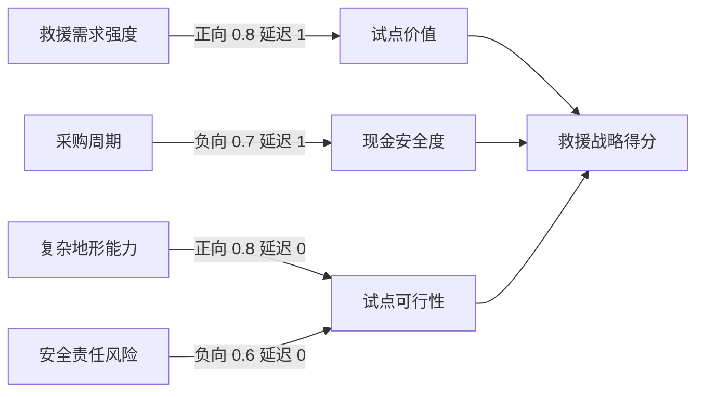

# 09. 决策沙盘与推演引擎

## 定位

决策沙盘用于因果推演和敏感性分析，不用于承诺精确预测未来。它回答的问题是：当关键变量改变时，哪些结论最容易变化，哪些假设最值得验证，哪个选项在不同情景下更稳健。

P0 沙盘必须从 `DecisionCase` 和深度报告生成初始图，并允许用户编辑节点、边、强度、延迟和关系质量。

## 图模型

沙盘使用有向因果图：

- 节点使用统一八类：`decision`、`lever`、`constraint`、`external`、`unknown`、`intermediate`、`outcome`、`indicator`。
- 边表示一个因素对另一个因素的影响方向、强度、延迟和关系质量。
- 情景只表示外部或未知变量的一组初始值与边强度乘数；风险偏好属于冻结的 Profile、AnalysisCharter、Strategy 或 ScoreDefinition，不进入 `ScenarioVersion`。



## 节点结构

```json
{
  "id": "node_procurement_cycle_months",
  "label": "采购周期",
  "type": "external",
  "baseline": 9,
  "current": 12,
  "min": 3,
  "max": 24,
  "unit": "months",
  "normalization": "inverse_linear",
  "sensitivityStep": 2.1,
  "controllability": "uncontrollable",
  "authorship": "generated",
  "evidenceStatus": "conditional",
  "evidenceQualityScore": 0.62,
  "evidenceIds": ["ev_012", "ev_014"],
  "assumptionIds": ["asm_procurement_window"],
  "rationale": "采购周期直接影响首个付费试点前的现金安全度。",
  "status": "confirmed",
  "editable": true
}
```

节点持久化和 API 使用业务单位，例如月、百分比或金额，并保存 `min`、`max` 与归一化方向。Simulation Engine 在纯函数入口统一转换到 `[0, 1]`，输出时再转换回业务单位。`inverse_linear` 用于“值越大越差”的指标，例如采购周期。禁止把示例中的 9 个月直接当作已归一化数值。

## 边结构

```json
{
  "id": "edge_procurement_to_cash",
  "sourceNodeId": "node_procurement_cycle_months",
  "targetNodeId": "node_cash_safety",
  "polarity": "negative",
  "strength": 0.7,
  "delaySteps": 1,
  "relationshipQualityScore": 0.64,
  "rationale": "采购周期越长，完成首个付费试点前的现金压力越高。",
  "claimIds": ["claim_procurement_gap"],
  "evidenceIds": ["ev_012"],
  "assumptionIds": [],
  "status": "draft"
}
```

边强度取值 `[0, 1]`，方向由 `polarity` 决定。`delaySteps` 表示影响延迟多少轮生效，P0 默认一轮代表一个观察周期，可由情景配置解释为周或月。

## 从报告生成因果图

输入来源：

- `StructuredReport.executiveBrief`：建议、条件、阈值、退出条件。
- `StructuredReport.options`：选项和预期结果。
- `DecisionCase.assumptionIds` 引用的 canonical `Assumption`，以及冻结 Dossier/Case 条目中 `statementType == assumption` 的已确认内容：驱动节点和不确定节点。
- 当前 ready Run 的 `Challenge`：按含义生成 `external`、`unknown` 或 `constraint` 节点及负向边。
- `DecisionCase.goals`：结果节点和评分权重。
- `EvidenceItem`：边和节点的依据。

生成规则：

| 报告内容 | 图对象 |
|---|---|
| 成立条件 | `lever`、`external` 或 `unknown` 节点 |
| 阈值 | 节点警戒线 |
| 退出条件 | `constraint`/`external` 节点或停止规则 |
| 领先指标 | `indicator` 节点 |
| 反方审查 | `external`/`unknown`/`constraint` 节点和负向边 |
| 选项 | 决策节点 |
| 推荐理由 | 支持边和评分说明 |

`from-report` 只创建不可变 `draft` `GraphVersion`，不能用请求参数自动确认。用户必须通过 graph bulk review 对每个自动节点和每条自动边执行 `confirm | modify | reject`；修改边必须同时给出修订后的强度、延迟、依据、`assumptionIds` 与关系质量，并明确确认，参与正式传播的节点必须收口为 confirmed。审阅成功创建新的 immutable `confirmed` `GraphVersion`，原 draft 和被否决节点/边保留用于审计。正式推演只接受 confirmed GraphVersion；draft GraphVersion 只能进入 experimental 推演。

## 影响传播公式

定义：

- `x_i(t)`：节点 `i` 在第 `t` 轮的引擎内部归一化值。
- `b_i`：节点 `i` 的业务基准值经 `normalize(node, value)` 转换后的结果。
- `delta_i(t) = x_i(t) - b_i`。
- `s_ij`：边强度，范围 `[0, 1]`，表达因果 effect strength。
- `p_ij`：方向，正向为 `+1`，负向为 `-1`。
- `q_ij`：边的 `relationshipQualityScore`，范围 `[0, 1]`，只表达证据、关系说明和可发布性质量，不进入 effect strength。
- `m_ij`：情景对边的乘数。
- `d_ij`：延迟轮数。
- `lambda`：阻尼系数，范围 `(0, 1]`，用于抑制循环图中的影响放大。

影响项：

```text
impact_j(t + d_ij) += delta_i(t) * p_ij * s_ij * m_ij * lambda
```

`relationshipQualityScore` 不得乘入上式。低关系质量通过 warning、解释质量和 formal 发布门处理；否则同一条边会同时被 `strength` 与 `quality` 重复衰减，无法区分“影响很弱”和“关系证据不足”。

节点更新。用户 override 是持续干预，不参与 baseline 回弹；其他节点每轮以 baseline、归一化情景偏移和当轮到期影响重新求值：

```text
if j is intervened:
  x_j(t + 1) = normalize(node_j, intervention_j)
else:
  x_j(t + 1) = clamp(b_j + scenario_shift_j + sum(impact_j(t + 1)), 0, 1)
```

`ScenarioVersion.nodeShifts` 始终是 `[-1, 1]` 的归一化 delta，不是月、金额或百分比等业务值。

解释质量聚合：

```text
explanation_quality_j = clamp(
  0.5 * node_evidence_quality_j +
  0.3 * average(incoming_relationship_quality) +
  0.2 * average(source_explanation_quality),
  0,
  1
)
```

该分数只是图节点的单维解释质量，不是统计置信区间、正确概率或成功概率；正式建议仍展示六维质量画像。

### 稳定性与收敛合同

对某一冻结 Scenario，令：

```text
L = lambda * max_target_j(sum_incoming_i(strength_ij * abs(edgeMultiplier_ij)))
```

在没有离散规则跳变的连续传播子图中，`L < 1` 是无穷范数下的收敛充分条件。formal 运行必须在开始前计算并保存该 stability bound；若 `L >= 1`，引擎仍可试算，但只有在 `maxSteps` 内实际满足 `epsilon`、没有非法数值且没有持续边界饱和时才可标记 `converged`。否则返回 `max_steps | saturated | invalid`，不得改变正式系统建议。

## 传播伪代码

```ts
interface SimulatedNode {
  value: number;
  explanationQualityScore: number;
}

function runSimulation(
  graph: GraphVersion,
  strategy: StrategyVersion,
  scenario: ScenarioVersion,
  scoreDefinition: ScoreDefinition,
  profile: DecisionMakerProfile,
  mode: "formal" | "experimental",
  nodeOverrides: Record<string, number> = {},
  epsilon = 0.001,
  maxSteps = 12
) {
  assertSimulationAuthorization(graph, mode);
  assertSimulationInputsBelongTogether(graph, strategy, scenario, scoreDefinition, profile);
  const nodesById = Object.fromEntries(graph.nodes.map((node) => [node.id, node]));
  const interventions = buildInterventions(graph.nodes, strategy, nodeOverrides);
  const state: Record<number, Record<string, SimulatedNode>> = {
    0: initializeNormalizedValues(graph.nodes, scenario, interventions)
  };
  const delayedImpacts = new Map<number, Map<string, number>>();
  const maxDelay = Math.max(0, ...eligibleEdges(graph, mode).map((edge) => edge.delaySteps));
  let stableRounds = 0;
  let convergenceStatus: "converged" | "max_steps" | "saturated" | "invalid" = "max_steps";
  let completedSteps = 0;

  for (let t = 0; t < maxSteps; t++) {
    for (const edge of eligibleEdges(graph, mode)) {
      const sourceState = state[t][edge.sourceNodeId];
      const sourceNode = nodesById[edge.sourceNodeId];
      const normalizedBaseline = normalize(sourceNode, sourceNode.baseline);
      const delta = sourceState.value - normalizedBaseline;
      const polarity = edge.polarity === "positive" ? 1 : -1;
      const multiplier = scenario.edgeMultipliers[edge.id] ?? scenario.defaultEdgeMultiplier;
      const impact = delta * polarity * edge.strength * multiplier * scenario.damping;
      addImpact(delayedImpacts, t + edge.delaySteps + 1, edge.targetNodeId, impact);
    }

    const dueImpacts = delayedImpacts.get(t + 1) ?? new Map<string, number>();
    state[t + 1] = {};
    let maxAbsoluteChange = 0;
    for (const node of graph.nodes) {
      const nextValue = interventions.has(node.id)
        ? normalize(node, interventions.get(node.id)!)
        : clamp(
            normalize(node, node.baseline) +
              (scenario.nodeShifts[node.id] ?? 0) +
              (dueImpacts.get(node.id) ?? 0),
            0,
            1
          );
      if (!Number.isFinite(nextValue)) return invalidSimulation("NON_FINITE_VALUE");
      maxAbsoluteChange = Math.max(maxAbsoluteChange, Math.abs(nextValue - state[t][node.id].value));
      state[t + 1][node.id] = {
        value: nextValue,
        explanationQualityScore: combineExplanationQuality(node, graph.edges)
      };
    }

    completedSteps = t + 1;
    stableRounds = maxAbsoluteChange < epsilon ? stableRounds + 1 : 0;
    if (stableRounds >= maxDelay + 1) {
      convergenceStatus = isPersistentlySaturated(state, completedSteps)
        ? "saturated"
        : "converged";
      break;
    }
  }

  return summarizeAndDenormalize({
    state,
    graph,
    strategy,
    scenario,
    scoreDefinition,
    profile,
    epsilon,
    maxSteps,
    completedSteps,
    convergenceStatus
  });
}
```

`assertSimulationAuthorization` 在 `formal` 模式要求 `graph.status == "confirmed"`，并要求所有参与传播的节点为 confirmed；`eligibleEdges` 此时只返回 `confirmed | conditional` 边。`experimental` 可读取 draft GraphVersion 并显式包含 `draft | confirmed | conditional` 边，但始终排除 `rejected`。服务端必须把模式写入 `SimulationRun.simulationMode`，不能靠 UI 标签区分。

引擎每轮必须检查：所有值为有限数、图引用存在、到期影响没有未知节点、最大绝对变化和持续边界饱和。默认 `maxSteps=12`、`epsilon=0.001`；达到最大步数仍未满足收敛条件返回 `max_steps`，大量节点持续落在 0/1 边界返回 `saturated`，NaN/Infinity 或无效引用返回 `invalid`。P0 UI 不把非 `converged` 运行用于正式推荐。

实验模式可以显式包含 `draft` 边，但结果必须标记为 `experimental`，不能用于正式推荐、PDF 或最终决定的系统建议。formal SimulationRun 必须来自 confirmed GraphVersion；两种模式都必须精确引用 `scenarioVersionId`，不得只传可变的 `scenarioId` 或内联未版本化情景对象。

## 方法情景到沙盘情景

full 报告不能只生成“乐观/基准/悲观”三个数值档。Synthesis 的 `scenario_planning` 透镜必须先给出至少三个结构不同的世界，包含既定因素、高影响/高不确定轴、时间线、利益相关方状态、早期预警信号和策略是否失效；Validation 接受后，用户审阅并把每个世界映射为不可变 `ScenarioVersion`。至少一个版本必须能使当前策略失效，否则返回 `STRATEGIC_LENS_INCOMPLETE`。

```json
{
  "id": "scenariover_procurement_delay_v1",
  "workspaceId": "ws_demo",
  "graphId": "graph_001",
  "decisionCaseId": "case_spherical_robot",
  "scenarioId": "scenario_procurement_delay",
  "version": 1,
  "name": "采购延迟但技术达标",
  "description": "技术试点达到门槛，但机构预算和采购审批显著延后",
  "sourceLensArtifactId": "lens_scenario_001",
  "sourceStrategicScenarioId": "scenario_procurement_delay_source",
  "strategySurvives": false,
  "earlyWarningSignals": [
    {
      "signalId": "signal_procurement_90d",
      "type": "quantitative",
      "observable": "采购立项等待天数",
      "thresholdOrPattern": "> 90 days",
      "cadence": "biweekly"
    },
    {
      "signalId": "signal_budget_code_missing",
      "type": "structural",
      "observable": "试点意向是否转为正式预算编号",
      "thresholdOrPattern": "连续两个复盘周期仍无预算编号",
      "cadence": "monthly"
    }
  ],
  "defaultEdgeMultiplier": 1.0,
  "edgeMultipliers": { "edge_procurement_to_cash": 1.2 },
  "nodeShifts": { "node_procurement_cycle_months": 0.25 },
  "damping": 0.85,
  "createdAt": "2026-07-10T16:00:00+08:00"
}
```

球形机器人 fixture 固定三组可重放的结构化情景：

| 情景 | 结构差异与主要映射 |
|---|---|
| 机构拉动且技术达标 | 救援机构试点需求明确、采购进入预算、复杂地形能力达标；需求和交付正向边增强 |
| 采购延迟但技术达标 | 技术达标但预算审批超过现金窗口；采购到现金的负向延迟增强，当前救援优先策略失效 |
| 监管收紧且家庭渠道前移 | 救援责任边界收紧、认证成本上升，同时家庭渠道合作提前；监管/责任风险增强并改变利益相关方状态 |

“乐观/基准/悲观”可保留为 QA 的参数压力预设或用户手动 experimental preset，但不能替代上述 Scenario Planning 产物，也不能单独满足 full 质量门。正式 UI 显示情景的业务名称、来源透镜、预警信号和 `strategySurvives`，不只显示高/中/低标签。

用户可以覆盖具体节点值，例如把“采购周期”从 `9` 个月调到 `14` 个月。

## 选项评分

选项评分来自版本化 `ScoreDefinition`，其中显式保存 `OptionOutcomeMapping`、`RiskWeight` 和 `ConstraintRule`。引擎不得根据节点名称或图位置猜测某个结果属于哪个选项。

```text
option_score = sum(goal_weight_k * outcome_value_k)
             - risk_tolerance * sum(risk_weight_r * risk_value_r)
             - constraint_penalty
```

硬约束触发时，`constraint_penalty` 足够大，使该选项不再被推荐。示例：如果救援方向预计在现金窗口内无法完成采购验证，救援试点选项在 P0 沙盘中直接降级。

评分只使用 `06-data-model.md` 的 canonical `ScoreDefinition`、`OptionOutcomeMapping`、`RiskWeight` 和 `ConstraintRule`；本文件不维护第二套接口。每次 `SimulationRun` 固定保存 `scoreDefinitionVersion`。

## 敏感性分析

P0 采用单变量扰动：

1. 对每个可编辑驱动节点优先使用 `CausalNode.sensitivityStep`；未配置时使用 `(max - min) * 0.1` 的业务单位步长。
2. 分别计算 `clamp(current - step, min, max)` 与 `clamp(current + step, min, max)`；禁止使用“当前值 ±10%”，以免零值、负值或不同量纲导致不可比较结果。
3. 重新运行用户选定的 confirmed 参考情景，并复用同一 profile、riskTolerance、score definition、epsilon、maxSteps 与 engineVersion。
4. 计算系统建议 outcome、选项评分和排序变化；系统 abstain 时比较 abstain 原因与是否恢复到 option。
5. 输出影响最大的变量列表，并保存实际使用的业务步长。

```text
sensitivity_i = max(
  abs(score_base - score_when_i_up),
  abs(score_base - score_when_i_down)
)
```

输出示例：

```json
{
  "topDrivers": [
    { "nodeId": "node_procurement_cycle_months", "label": "采购周期", "scoreDelta": 0.18 },
    { "nodeId": "node_terrain_reliability", "label": "复杂地形可靠性", "scoreDelta": 0.14 }
  ],
  "recommendationShift": "若采购周期超过 12 个月，推荐从救援市场试点切换为继续研究。"
}
```

## UI 展示要求

沙盘页使用任务优先、渐进展开的交互。默认视图必须让用户在不理解图模型的情况下完成一次压力测试，并展示：

- 当前条件化建议、适用条件和限制说明。
- 最多三个最脆弱条件；每项显示业务单位、是否可控、证据状态、关系质量摘要和影响说明。
- 当前选中条件的业务单位滑杆/数值输入，或已确认情景切换。
- 运行前后的相对基线变化、选项排序或硬门变化。
- “建议保持 / 建议翻转 / 证据不足无法判断”三类明确结果，以及翻转阈值或当前测试范围。
- 一至三阶关键影响路径和触发的硬约束。
- “生成验证行动”“保存实验分支”“展开完整模型”三个后续动作；不把“保存到档案”作为直接动作。

用户展开完整模型后，再展示：

- 因果图画布、节点详情和边详情。
- 全部敏感性排序和选项评分变化。
- 自动节点/边确认面板。
- 当前 graph、strategy、scenario、score definition 和 engine 版本。
- 工作副本、分支时间线、版本比较和非破坏性回滚。

每个自动生成节点和每条自动生成边都显示来源与依据；边额外显示“关系质量”。用户可确认、修改或否决节点和边。

图审阅面板必须能一次提交逐节点、逐边的 `confirm | modify | reject` 结果，并清楚显示新 confirmed graph version；draft 仍只显示实验运行入口。

图审阅默认按决策影响排序，而不是按节点或边 ID 排序：会改变推荐、触发硬约束或同时具有高影响和低关系质量的项目优先；其余项目可折叠并批量确认。批量确认不得隐藏来源、假设或低质量警告。

压力测试交互不得要求用户编辑归一化值、阻尼、边乘数或评分公式。用户只操作有业务含义的变量和情景；高级模型参数不进入 P0 用户界面。

## 用户添加因素与即时实验预览

P0 的默认压力测试继续只显示当前结论最脆弱的最多 3 个业务条件，不在首屏铺开建模工具。“添加影响因素”只出现在按需展开的完整模型工具栏中，并遵守以下合同：

1. 用户以自然语言描述因素后，系统生成 `FactorCandidate`，不得直接修改图。例如“地方预算审批稳定性可能拖慢采购周期”。
2. 候选节点必须给出业务名称、节点类型、单位、基线/当前值/上下界、可控性、证据状态和理由。用户添加入口不允许创建 `decision` 节点。
3. 系统可以建议影响关系，但每条 `RelationshipCandidate` 必须显示方向、强度、延迟、关系质量以及证据/假设来源，并由用户逐条确认、修改或否决。
4. 接受后的节点和边只写入 `GraphWorkingCopy`，保持 `draft`，并通过 `baseGraphVersionId + revision` 乐观锁保护；不得原地覆盖任何 `GraphVersion`。
5. 没有证据的因素默认标记为 `assumed` 或 `unknown`。系统可以计算“如果成立会怎样”，但不得把它描述为已证实事实，也不得伪造翻转阈值。
6. 工作副本变化后，客户端等待 300–500ms debounce，再请求确定性的 `ExperimentPreview`。P0 fixture 图目标为预览 `p95 <= 1s`；超时或失败必须显示可重试状态，不能展示旧结果冒充新结果。
7. 预览必须显示所用工作副本 revision、变化路径、敏感因素、建议是否变化和证据不足警告。相同输入必须得到相同输出；revision 变化后旧预览立即标记 stale。
8. `ExperimentPreview` 不是 `SimulationRun`，不能进入 PDF、DecisionRecord、正式推荐或审计导出。界面必须持续显示“实验预览，不代表正式结论”。
9. 正式运行仍要求用户把工作副本保存为新的不可变 `GraphVersion`，完成确认门，再主动创建 `formal` `SimulationRun`。保存实验分支也不能自动升级为正式结论。

即时反馈的目的，是帮助人观察假设结构和因果敏感性，而不是让模型替人决定。系统建议节点与边，人负责定义问题、审阅关系、解释结果并承担最后决策责任。
## Strategy、Scenario 与版本

- Strategy 是决策人主动选择的一组 decision/lever 覆盖；Scenario 是 external/unknown 的一组外部假设。两者不得混用。
- Constraint 只有在显式实验覆盖时可修改，运行必须标记为 `experimental` 并显示警告。
- `CausalGraph.id` 是稳定图聚合 ID，`GraphVersion.id` 是每次保存产生的不可变 `graphVersionId`；运行、比较、回滚和最终决定始终引用后者。
- `ScenarioVersion.id` 是运行输入中的 `scenarioVersionId`；情景编辑产生新版本，旧 SimulationRun 永远保留原引用。
- 每次 `SimulationRun` 固定引用 `graphVersionId`、`strategyVersionId`、`scenarioVersionId`、`scoreDefinitionId/version`、`decisionMakerProfileId/version`，并冻结实际 `riskTolerance`、`epsilon`、`maxSteps` 与 `engineVersion`。
- 服务端计算的 `inputHash` 必须覆盖上述引用和值、归一化节点覆盖、图内容哈希和情景内容哈希；重放只接受完全相同的冻结输入，不能从“当前 Profile”补值。
- 保存工作副本产生不可变图版本；从历史版本创建 `GraphBranch`；回滚通过从目标历史版本生成新当前版本完成，不删除后续历史。
- 输入版本完全相同时，纯函数引擎必须输出完全相同的节点结果、选项评分和敏感性排序。

## 合同生成与开发 ownership

图、Strategy、Scenario、ScoreDefinition、SimulationRun 与错误响应的 wire type 由 Pydantic/OpenAPI 生成 TypeScript；Web 图组件不得维护平行 DTO。Simulation Engine 与 Simulation UI 分别由 manifest 的 Simulation/Graph owner 写入，QA 只提交确定性、翻转、可访问性和响应式缺陷 handoff。任何评分字段或图枚举变化必须通过 CCR。

## 推演议会编排（CCR-20260804-DELIB-01）

议会是因子沙盘之上的长程推演层，不改变确定性引擎本身：

- 参与者：每个因子一个持证人智能体（客观因子持证据与来源，主观因子持 Human 署名声明），一个主持智能体组织轮次；编排器是 worker 侧新 job kind，复用 `FOR UPDATE SKIP LOCKED` 队列、heartbeat 与 attempt，不是第五类正式分析 Worker。
- 轮次协议：R0 opening（持证人并行 structured output：立场/主张影响/依据/对他者质疑，引擎同时算基线投影）→ R1..n challenge（回应质疑、产出提议，主持过滤后挂账待用户采纳）→ verdict（主持合成 outcome）。轮间检查介入队列与用户决策；主持提名使 run 进 `awaiting_user`。
- **引擎裁决铁律**：一切数值（强度、投影、翻转点）只能由 `simulate()` 计算；被采纳提议落 override 后重算并产出 delta。智能体输出经 Pydantic schema 校验，失败至多一次修复重试，仍失败则丢弃并留痕；智能体不得自报数值结果。
- 预算硬上限：maxRounds ≤ 5、每轮发言数上限、单 run token 预算；超限即推进 verdict 并在 outcome 诚实注记。
- FIXTURE_MODE 提供确定性夹具证人/主持，全套编排无 Key 可跑；originModes 诚实记录，不得冒充实时结果。
- 产出为条件化预估（采纳提议集 → 引擎投影 + 翻转条件 + 异议留档），禁止任何概率化断言；议会结果不进入 DecisionRecord 或正式报告，只作为推演域留档与候选输入的素材。

## 限制说明

- 不使用沙盘输出表达未来确定结果。
- 不用缺少证据的边支撑强推荐。
- 不把模型生成的因果关系当作事实。
- 不在 P0 中做复杂系统动力学或概率预测。
- 不允许沙盘改变最终决定，除非用户显式保存。

