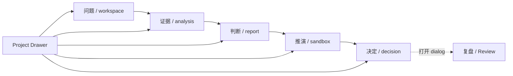

# 11. 前端规格

## 文档状态与权威来源

本文是 Ludus P0 前端信息架构、路由、数据读取面、状态与验收的 canonical 合同。`E:\Temp\xiayu\Documents\adventure-x\look` 是最终视觉与关键交互设计源；`24-frontend-visual-theme.md` 定义其生产接入方式。`look/` 是静态原型，不连接后端，也不得被生产 Web 直接加载。

发生冲突时按以下顺序处理：

1. `06-data-model.md` 的领域、状态、权限和不可变性；
2. `10-api-and-events.md` 的 API/SSE；
3. 本文的 IA 与交互；
4. `24-frontend-visual-theme.md` 和固定 Look 快照的视觉细节。

前端只能消费 OpenAPI 生成的 TypeScript 类型/client，不得复制领域 DTO 或用原型状态代替服务端状态。

## Canonical 信息架构

登录不是决策工作区。登录后围绕一个当前 Workspace 和可选当前 `DecisionCase` 展示 Decision Spine。主工作区精确为五个：

| 顺序 | 用户标签 | view ID | 责任 | 主要对象 |
|---:|---|---|---|---|
| 1 | 问题 | `workspace` | 界定问题、目标、约束、选项和待确认候选 | DecisionCase、DossierVersion、CandidateRevision、ArgumentNode |
| 2 | 证据 | `analysis` | 确认 Charter、查看 Run、证据、工具和五项透镜 | AnalysisCharter、AnalysisRun、AnalysisEvent、EvidenceItem、StrategicLensArtifact |
| 3 | 判断 | `report` | 阅读条件化建议、反方、未知和质量门 | FocusedResearchResult 或 StructuredReport、JudgmentSet、DissentRecord |
| 4 | 推演 | `sandbox` | 审阅因果图、运行情景与寻找翻转条件 | GraphVersion、GraphWorkingCopy、ScenarioVersion、SimulationRun |
| 5 | 决定 | `decision` | 审阅 SignoffPayload、签署、读取决定历史与行动 | SignoffRequest、DecisionRecord |

Review 不是第六个主工作区。它是从 Decision Spine 的“复盘”动作或决定页打开的可恢复 dialog/drawer；关闭后焦点回到触发器，刷新后仍可通过 URL/query 恢复正在查看的 `reviewId`。



## 路由与 URL 状态

生产路由使用稳定 Case URL，并把工作区作为可分享、可恢复的 view：

```text
/w/{workspaceId}/cases/{decisionCaseId}?view=workspace
/w/{workspaceId}/cases/{decisionCaseId}?view=analysis
/w/{workspaceId}/cases/{decisionCaseId}?view=report
/w/{workspaceId}/cases/{decisionCaseId}?view=sandbox
/w/{workspaceId}/cases/{decisionCaseId}?view=decision
/w/{workspaceId}/cases/{decisionCaseId}?view=decision&reviewId={reviewId}
/w/{workspaceId}/empty
```

- `decisionCaseId` 和 `analysisRunId` 是唯一 Case/Run wire 名称。
- Project Drawer 切换 Case 时保留合法主题，清除不属于新 Case 的 report/graph/review selection。
- 用户无任何 Case 时进入 `empty`；不得创建伪造的 Decision Spine 状态、证据数、Run、报告或推荐。
- 未授权、跨 Workspace 或资源不属于当前 Case 时统一显示不存在，不泄露对象存在性。
- URL 是导航状态，不是权限或领域状态来源；服务端响应始终是事实源。

## App Shell、Project Drawer 与空项目

### App Shell

Masthead 显示 Ludus、当前项目、来源模式、主题入口和档案入口。Decision Spine 在桌面为横向，在移动端可以水平滚动或压缩为可访问的步骤控件，但五个 view 的顺序和语义不得改变。

### Project Drawer

Project Drawer 必须提供：

- 当前 Workspace 的 Case 列表、状态、版本、更新时间和下一步；
- 创建新 Case 的入口；
- 键盘关闭、焦点圈定与关闭后焦点回归；
- loading、empty、error 和分页状态；
- 不在客户端全局缓存其他 Workspace 的 Case。

### `empty` view

空项目页只允许：输入决策问题草稿、导入材料、选择示例问题填入草稿、显式创建 Case。示例只填充输入，不自动创建 Case，不自动运行分析，也不生成证据、报告、沙盘或决定。

## 工作区一：问题 `workspace`

默认展示安静的日常问答与 Deliberation Ledger，而不是营销落地页或模板墙。必须支持：

- 输入问题、上下文和材料；
- 读取 Case、DossierVersion 与 ArgumentNode 投影；
- CandidateRevision 的逐条确认、修改类型、否决和批量审阅；
- 事实、约束、假设、判断、未知项的责任语义；
- Quick Analysis 的非正式标识；
- 选择 `quick | focused | full`，由系统推荐方法；
- 打开 Analysis Charter dialog，确认后才创建正式 Run。

候选和系统挑战不能直接写入正式档案。确认动作必须显示 base version；版本冲突时保留用户输入并提供刷新/重新审阅。

## 工作区二：证据 `analysis`

证据区显示 AnalysisRun 的真实状态，而不是模拟进度。必须提供：

- confirmed Charter 摘要、方法 ID/version/hash 和冻结范围；
- queued 到 ready/blocked/needs_attention/cancelled 的状态；
- SSE 重连、`Last-Event-ID` 恢复、取消和允许的 resolution；
- Agent role、工具调用、连接器、来源模式和错误；
- Evidence Ledger、SourceRecord/SourceSpan 和引用保管链；
- full Run 五项 StrategicLensArtifact 的列表/单项读取；focused 不伪造 lens；
- blocked、needs_attention、provider fallback 与 stale 的可恢复 UI。

点击引用打开 Evidence Drawer。Drawer 显示来源、quote、定位、质量、相反证据与 originMode，不显示隐藏思维链或未清洗 provider 输出。

## 工作区三：判断 `report`

判断区根据授权展示 `FocusedResearchResult` 或 `StructuredReport`：

- 执行简报、选项比较、条件、阈值、退出条件、行动项和领先指标；
- `SystemRecommendation` 判别联合：推荐 option 或 abstain；
- supporting/opposing Claim、JudgmentSet、DissentRecord 和 unresolved Unknown；
- 六维质量画像和 weakest dimension；
- 五项 lens 的来源与关键结论；
- HTML/PDF 状态、下载和失败重试；focused 隐藏 PDF 与正式沙盘入口。

系统 abstain 时首屏明确说明“系统未形成可发布选项建议”，展示 reasonCodes 与 rationale；不得以空选项、默认第一项或弱化文案伪装推荐。

## 工作区四：推演 `sandbox`

默认是业务可理解的压力测试，不先展示复杂建模器：

- 最多三个最脆弱条件、业务单位、翻转阈值和硬约束；
- Scenario Planning 生成的结构化世界、早期预警和 strategySurvives；
- frozen profile/riskTolerance/score definition/epsilon/maxSteps 与 inputHash 的只读详情；
- 非 converged、saturated、invalid 不能改变正式建议。

按需展开完整因果模型后，用户才能：

- 审阅自动节点/边并执行 `confirm | modify | reject`；
- 创建 GraphWorkingCopy，undo/redo，添加 FactorCandidate；
- 生成带 `experimental` 标识的 ExperimentPreview；
- 保存不可变 GraphVersion；
- 创建命名分支、比较和非破坏性回滚；
- 主动运行 formal SimulationRun。

`relationshipQualityScore` 只表现关系证据与解释质量，不作为边影响强度的视觉替代；界面分别编辑 strength 与 relationship quality。

## 工作区五：决定 `decision`

决定页是责任与冻结面，不是“接受 AI 建议”按钮。必须提供：

- 来源 Case/Run/Report/Judgment/Dissent/Graph/Simulation 链；
- 完整 SignoffPayload 预览与 payloadHash；
- 系统 option/abstain、人的 selectedOptionId 和接受的 Unknown；
- 条件、阈值、退出条件、行动项、领先指标和 reviewDate；
- signer capability、session 失效、nonce 轮换、过期和 stale 状态；
- 签署声明及明确的人类责任提示；
- DecisionRecord original/revision 历史与不可变 hash。

只有活动 UserSession、活动 WorkspaceMembership 且具有 `sign` capability 的人能看到可用签署动作。客户端不得提交 `signedByUserId`。

## Dialog 与 Drawer

Look V7 的关键覆盖层映射为：

| 原型交互 | 生产组件 | 合同 |
|---|---|---|
| Case selector | `ProjectDrawer` | Case 列表/创建/切换；切换时清理跨 Case selection |
| 档案 | `DossierDrawer` | 当前 Dossier/Case 条目、候选数和版本 |
| Evidence | `EvidenceDrawer` | SourceSpan、引用、质量和相反证据 |
| Charter | `AnalysisCharterDialog` | 分析深度、方法理由、冻结字段和确认 |
| Review | `ReviewDialog` | Review 创建/读取；不改变 DecisionRecord |
| Theme selector | `ThemeDrawer` | 十个公开主题；不触发领域 mutation |

所有 modal/drawer 必须有名称、`aria-modal`、Escape、focus trap、关闭后 focus return；背景不可被键盘访问。

## Look V7 生产接入

`look/` 仅作为设计输入。正式实现必须：

1. 生成 `design/look-source-manifest.json`，记录 `look/VERSION`、导入日期、核心文件 SHA-256 和 bundle hash；
2. 把 `themes.css` 转换为集中 token；不得在 JSX 散布十套十六进制值；
3. 把 `styles.css` 拆为 semantic、layout 和 component layer；
4. 把 `index.html` 的结构映射为 React/Next.js 组件；
5. 只把 `app.js` 当行为规格，不通过 script、iframe、复制全局状态或 DOM query 方式加载；
6. 把原型的键盘、focus、空项目、主题和 dialog 行为移植为 Vitest/Testing Library/Playwright/Axe 测试；
7. 数据全部来自生成 API client、TanStack Query 和 SSE adapter。

当前审计快照的核心 bundle hash 为 `sha256:c5d5d65bf62efdd14e4e3e13d1c70b92f9d6b4cdd4dbd2f652107d84d1a55e98`；算法按 `VERSION/README.md/index.html/themes.css/styles.css/app.js` 的相对文件名与原始字节依次哈希。正式导入时必须重新计算；不一致时停止自动移植并记录新的设计变更，不依赖 `look/HEAD` 的 Logo 工作状态。

## 状态、缓存与恢复

每个主工作区至少覆盖：`loading | empty | ready | error | blocked | needs_attention | unsupported | fallback | stale`。mutation 失败不能清空用户输入。

TanStack Query key 必须至少包含 `workspaceId` 和资源 ID；Case 切换、登出和 session 撤销时清除不可继续使用的缓存。SSE 事件只更新进度投影；大型 artifact 通过读取 API 获取。fixture/cached/live 标识随数据传播，不能被 UI 合并成“已完成”。

## 响应式与可访问性

- 主验收视口：1440×900、1024×768、390×844。
- 390×844 不允许正文横向滚动；因果图可使用独立可滚动画布。
- 触控目标至少 44×44 CSS px；正文和关键状态满足 WCAG AA 对比度。
- 不仅靠颜色区分 Human、Analysis、Unknown、状态和来源模式；同时使用文字/图形/图案。
- 支持 `prefers-reduced-motion`；主题切换、drawer 和 spine 动画不得阻塞操作。
- 所有图标按钮使用 `aria-label`；图表提供文字摘要和键盘可达的节点/边详情。

## 前端完成标准

- 五主工作区、Project Drawer、empty view 和 Review dialog 与 Look V7 一致；不存在“四页 + 决定抽屉”的平行 IA。
- 十主题 ID 与默认主题精确通过验证；切换主题不修改数据或重跑分析。
- 所有必需读取 API 已在 `10-api-and-events.md` 定义并由生成 client 消费。
- Source、abstain、Signoff、Simulation inputHash 和 session/capability 状态可见且不能被 UI 绕过。
- 生产包不包含或网络加载 `look/app.js`、`look/index.html` 或静态原型运行时。
- 组件、集成、Playwright 与 Axe 验收通过，三视口无阻断缺陷。
