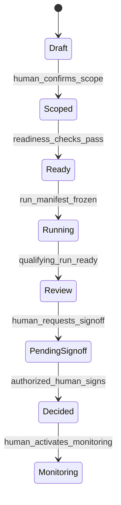

# 26. 决策操作系统工程不变量与 Agent Engine 合同

- 状态：canonical / accepted
- 生效日期：2026-07-21（星期二）
- 关联变更：`docs/contract-changes/CCR-20260719-002.md`、`docs/contract-changes/CCR-20260721-003.md`
- 关联审计：`docs/audits/strategy-analyst-recommendation-audit-20260719.md`

## 1. 产品身份

Ludus 是决策操作系统，不是聊天工具套壳。聊天可以作为低风险输入入口，但正式分析、报告和决定必须经过版本化领域对象、真实状态机、冻结运行、结构化产物、质量门与人类签署。

三类责任语义必须由代码执行：

| 责任类 | 含义 | 可执行动作 | 禁止动作 |
|---|---|---|---|
| `human` | 问题、偏好、承诺、确认、覆盖和签署 | 确认范围、确认 Charter、覆盖 Cynefin、请求签署、签署决定、接受未知风险 | 伪装成系统分析、静默改写历史分析 |
| `analysis` | 系统检索、分析、批判、综合、验证和模拟 | 产生 Claim/Evidence/Judgment/Dissent/DraftRecommendation、提出候选 | 签署决定、把建议标记为人类承诺、自动进入 Decided |
| `unknown` | 已知未知、假设、冲突、缺口和翻转条件 | 阻断、降级、触发补证或由人明确接受 | 被低置信度分数静默吞并、被当作事实 |

所有正式对象必须携带 `ResponsibilityStamp`；schema、服务授权、事件和测试共同验证 actor 与 responsibility 一致。

## 2. 可追溯链

canonical 链为：

```text
RawArtifact
  → SourceRecord
    → SourceSpan
      → EvidenceItem
        ↔ ClaimEvidence
          → Claim
            → Judgment
              → JudgmentSet + DissentRecord + DraftRecommendation
                → ReportArtifact
                  → SignoffRequest
                    → DecisionRecord
```

### 2.1 Source 与 Claim

- `SourceRecord/SourceSpan` 使用 `sourceScope: pre_run | run_frozen` 判别联合。消息、Case 字段和上传材料先形成 pre-run 来源；创建 Run 时把允许材料冻结为新的 run-scoped 记录。
- `pre_run` 不得携带 `analysisRunId`；`run_frozen` 必须携带 `analysisRunId`、原 pre-run 来源 ID、内容哈希和冻结时间。
- `rawArtifactId` 只在来源真实经过 RawArtifact 时存在；human input 和 case snapshot 不得伪造 RawArtifact。
- `SourceSpan` 必须有确定性 locator。网页/文本至少保存 paragraph/character range；PDF 保存 page + range；表格保存 sheet/row/column；用户输入保存 Case 字段或消息 locator。
- `quoteHash` 由规范化片段计算，服务端必须验证它与对应 source scope 的内容一致；run-frozen span 还要验证原 span/hash 链。
- 每个 Claim 必须至少引用一个 `sourceSpanId`。Claim 与 Evidence 的 supporting/opposing 关系只通过 `ClaimEvidence` 建立，并保存方向、强度、理由和 verdict。

### 2.2 Judgment 与反方

`Judgment` 是独立、不可变、Run-scoped 的分析对象，不再仅依赖 `StatementType=judgment`：

- 必须引用 supporting/opposing Claim；
- 必须引用相关 Unknown、Challenge 和成立条件；
- 必须记录 producer role、validation status、内容哈希；
- 不能被用户签署为 Decision，也不能被系统覆盖为 human responsibility。

`JudgmentSet` 聚合同一 Run 的判断；`DissentRecord` 保存尚未解决的反对意见、少数判断、证伪条件和处理结果；`DraftRecommendation` 是分析建议，不是决定。

## 3. 决策生命周期



canonical 枚举：

```text
draft | scoped | ready | running | review | pending_signoff | decided | monitoring
```

`blocked | needs_attention | cancelled | reopened | archived` 属于 operational status 或 Run 子状态，不得混入主阶段。

### 3.1 转换主体和门

| From | To | 主体 | 必须满足 |
|---|---|---|---|
| draft | scoped | human | 问题、责任人、目标、边界和基本材料确认 |
| scoped | ready | domain service | 必需输入完整；Cynefin gate 允许，或有可审计的人类 override |
| ready | running | run service | confirmed Charter；RunManifest 已冻结；同 Case 无活动正式 Run |
| running | review | worker/domain service | Run `ready`；所需结构化产物和验证 blocker 全部通过 |
| review | pending_signoff | human | 选项、条件、未知、反方和来源版本已审阅；创建 SignoffRequest |
| pending_signoff | decided | authorized human only | 签署声明、签署人、时间、request nonce/hash 完整 |
| decided | monitoring | human | 明确启用监测计划、指标、阈值和复盘日期 |

系统代码和 Agent 代码不得自动执行 `pending_signoff → decided`。Agent 工具注册表中不得出现 `sign_decision`、`transition_to_decided` 或等价能力。

## 4. 三条工程红线

### 4.1 禁止自动 DECIDED

- 只有 `POST .../signoff-requests/{id}/sign` 可以创建 DecisionRecord；
- API 必须解析当前会话中的人类用户，客户端不得提交任意 `signedByUserId`；
- DB insert 必须验证同 Workspace/Case 的 pending SignoffRequest、nonce/hash 和授权 capability；
- Worker、ModelProvider、fixture 与管理员后台不得拥有签署命令；
- 任何自动建议保持 `analysis` + `draft`。

### 4.2 DecisionRecord append-only

- DecisionRecord 在插入后禁止 UPDATE/DELETE；
- 修订创建新记录并用 `supersedesDecisionRecordId` 指向旧记录；
- `DecisionLifecycleEvent` append-only；当前显示状态由 projection 派生；
- Review、Monitoring 或 superseded 状态不得回写旧记录；
- 数据库 trigger/policy、repository、API 和测试必须同时执行。

### 4.3 没有 Run 就没有 Report

- `ReportArtifact.analysisRunId` 为非空 FK；
- Report 与 Run 必须属于同一 Workspace/Case/Charter 快照；
- 只有 Report Publisher 可从正式 Run 的阶段产物创建报告；
- `ready` 报告要求 Run `ready` 且全部发布 blocker 通过；
- 客户端和 Agent 无通用 Create Report 工具；
- 未完成 Run 只能保留绑定该 Run 的内部 draft artifact，不能发布、导出、建图或签署。

## 5. Run Manifest 与 Cynefin 前置门

正式运行先创建不可变 `RunManifest`：

```text
Case Charter + Case/Dossier Snapshot + Material Snapshot + Analysis Depth
+ Method ID/Version/Hash + Budget + Allowed Tools/Connectors
+ CynefinGateResult + Idempotency Key
→ RunManifest
```

`CynefinGateResult.domain`：

- `clear`：默认 quick；有理由可 focused；
- `complicated`：默认 focused；高风险/高不可逆性可 full；
- `complex`：允许 focused/full，必须包含 safe-to-fail probes 与 review triggers；
- `chaotic`：先稳定和 act-sense-respond，默认阻断长分析；
- `disorder`：阻断，补充边界后重判。

任何 override 必须由人类提交 reason，写入 append-only 事件，并冻结到 Charter 与 RunManifest。

## 6. 正式分析管道

```text
DeepAnalysisRequest
→ freeze RunManifest
→ Cynefin gate enforcement
→ Research
→ strategic lenses / evidence normalization
→ Critic + Safety Anchor + adversarial review
→ Synthesis
→ Validation Orchestrator (9 contracts)
→ DeepAnalysisResult
```

正式输入不是 chat messages：

```ts
type FormalAnalysisLevel = "focused" | "full";

interface MethodVersionRef {
  id: string;
  version: string;
  contentHash: string;
}

interface DeepAnalysisRequest {
  workspaceId: string;
  decisionCaseId: string;
  analysisRunId: string;
  charterId: string;
  charterVersion: number;
  caseSnapshotHash: string;
  dossierSnapshotHash: string;
  materialSnapshotHash: string;
  analysisDepth: FormalAnalysisLevel;
  method: MethodVersionRef;
  budget: Record<string, number>;
  allowedTools: string[];
  allowedConnectorIds: string[];
  idempotencyKey: string;
}
```

正式输出只返回已持久化对象 ID/hash；完整对象通过 Workspace/Run-scoped API 读取：

```ts
interface DeepAnalysisResult {
  analysisRunId: string;
  runManifestId: string;
  runManifestHash: string;
  judgmentSetId: string;
  dissentRecordId: string;
  draftRecommendationId: string;
  unresolvedUnknownIds: string[];
  validatorResults: ValidatorResult[];
  qualityGateResultId: string;
  provenanceHash: string;
}
```

自然语言正文是结构化对象的渲染结果，不是唯一事实来源。正式接口禁止以 `messages[]` 作为主输入，也不返回聊天式“一段答案”替代结构化结果。

## 7. 九项验证合同

一个 `ValidationOrchestrator` 执行九个版本化合同；P0 可在单个 Validation Worker 中串行或有界并行运行，不建立九个长期服务：

| ID | 职责 | 默认实现 |
|---|---|---|
| V1 | Scope / Charter | deterministic + schema |
| V2 | Source Traceability | deterministic |
| V3 | Evidence Quality | deterministic rules + source metadata |
| V4 | Claim–Evidence Entailment | semantic model + deterministic bounds |
| V5 | Contradiction / Time / Denominator | hybrid |
| V6 | Unknown / Assumption Coverage | deterministic + semantic |
| V7 | Adversarial / Dissent Sufficiency | semantic model |
| V8 | Causal / Simulation Integrity | deterministic graph checks |
| V9 | Publication / Decision Authority | deterministic, fail-closed |

每个 Validator 输出 strict JSON：`validatorId/version/outcome/findings/artifactRefs/repairTarget/executionMode/modelInvocationRef?`。结果使用 `pass | warn | block`；任一 `block` 阻止发布，禁止多数投票覆盖 blocker。

配置的 provider-neutral 语义校验模型只能通过 provider adapter 执行需要语义判断的 validator。领域层不硬编码模型名；授权、签署、append-only、FK、scope 和状态迁移必须由确定性代码与数据库执行。

## 8. 权限分期

P0 canonical 存储只使用两种 role，并通过 capability 表达动作权限：

- `owner`：默认拥有 `contribute/review/sign/manage_connectors`；
- `member`：由 `WorkspaceMembership.capabilities[]` 显式授予 `contribute/review/sign/manage_connectors` 的子集；
- `sign` 是人类 capability，不是 Agent role；Worker、fixture、service account 永远不能拥有；
- JWT 的 `session_id` 必须映射活动 `UserSession`，撤销或过期 session 立即失效；
- sign command 必须同时验证活动 session、同 Workspace membership、`sign` capability、payload hash、nonce 与有效期。

UI 隐藏按钮不构成授权。所有 capability 均由服务端 dependency/domain service 验证，并通过跨 Workspace 和被撤销 session 测试。

## 9. 能力分期

- 数据库任务队列、RunManifest、真实状态机、signoff、SourceSpan、Judgment/Dissent、九验证合同：P0 必需；
- Night Desk 因果图、GraphVersion 和正式模拟：full 路径能力，可在 focused 垂直切片稳定后接入；
- 九个模型并发实例、复杂 RBAC、外部自动监控：P1；
- 模型签署、Agent 自动决定、无 Run 报告、历史覆盖：永久禁止。

## 10. 最低测试合同

必须存在并通过：

```text
test_no_agent_decision_tool
test_pending_signoff_requires_human_signature
test_signoff_payload_hash_covers_complete_decision
test_revoked_session_or_missing_sign_capability_rejected
test_decision_record_update_delete_rejected
test_decision_revision_supersedes_without_overwrite
test_no_run_no_report
test_report_ready_requires_ready_run_and_validation
test_claim_requires_source_span
test_pre_run_source_has_no_analysis_run
test_run_freezes_pre_run_source_and_span
test_source_span_quote_hash_matches_snapshot
test_cynefin_chaotic_and_disorder_block_formal_run
test_deep_analysis_contract_has_no_chat_messages
test_deep_analysis_result_is_id_based
test_system_can_abstain_without_fake_option_id
test_nine_validator_contracts_exact_set
test_validation_blocker_cannot_be_outvoted
```

这些测试是发布门，不是建议性检查。